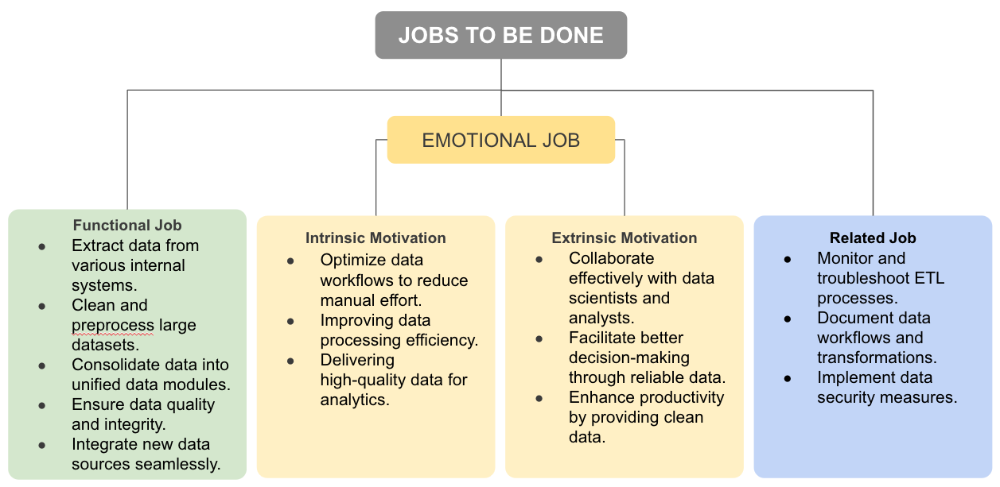
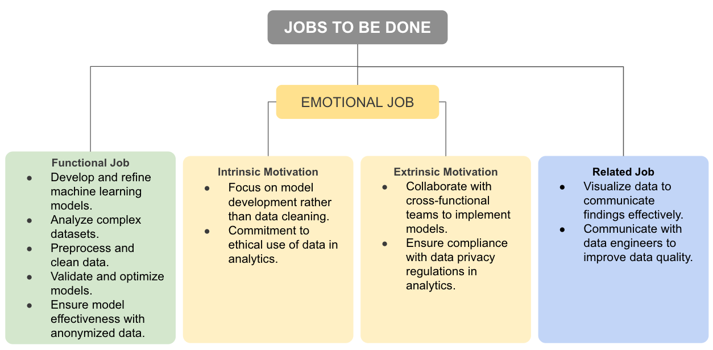
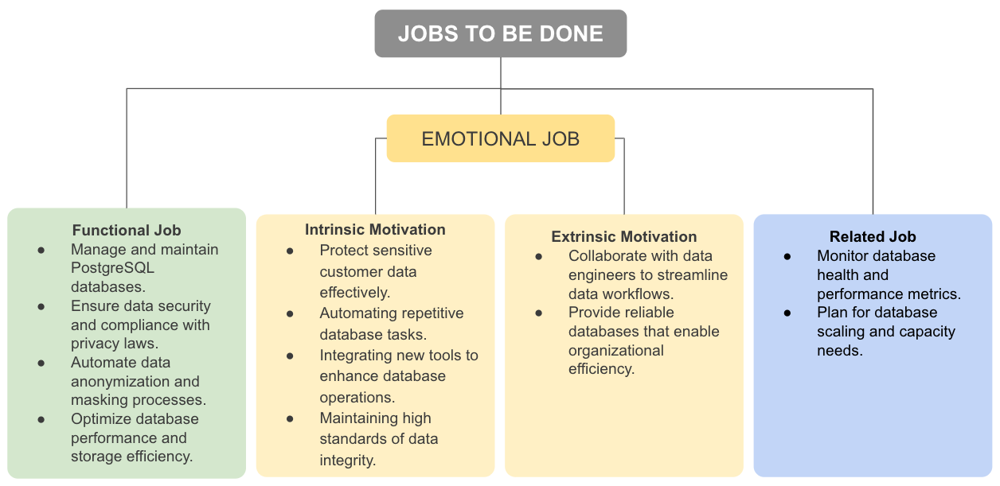
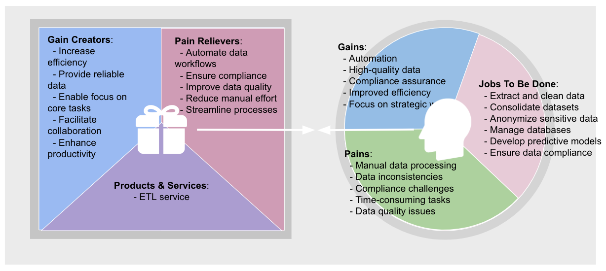

# ETL-Express 

> ETL service that helps to deliver data from corporate systems to MLOps framework.

## Roles

### Data engineer

#### Description:

Alexei, a 27-year-old data engineer based in Moscow, works at a big e-com company. With a Master's degree in Computer Science from Higher School of Economics, Alexey works as a data engineer in a large e-com company. He earns 350,000₽ per month.
Alexei's primary focus is on efficiently processing and cleaning large volumes of transactional data for downstream analytics. His main motivation is to automate data pipelines to reduce manual workload and enhance data quality. Now he is facing a number of challenges: he spends an excessive amount of time on manual data cleaning, struggles with inconsistent data formats, and finds it difficult to integrate data from multiple sources.
Alexei discovers a new ETL service that automates data extraction, transformation, and anonymization. By implementing this solution, he streamlines his workflows, enabling him to focus on more strategic tasks like optimizing data models.

### Data scientist

#### Description:

Svetlana, a 29-year-old data scientist based in Saint Petersburg, works at a healthcare startup. With a PhD in Data Science from Moscow State University, Svetlana is deeply committed to advancing her field by developing predictive health models. She earns 300,000₽.
Svetlana's key need is access to high-quality, anonymized patient data that allows her to create accurate and reliable predictive models for healthcare. Her main motivation is to minimize the time spent on data preprocessing, so she can focus more on developing and refining algorithms. However, she encounters several challenges: she often works with incomplete or disorganized datasets and has considerable concerns about adhering to data privacy regulations.
Svetlana adopts a new ETL service designed to provide clean and anonymized datasets. This solution reduces her data preparation time and ensures compliance with privacy laws, allowing her to accelerate the development of predictive models and focus on her core expertise.

### Database administrator

#### Description:

Dmitry, a 35-year-old database administrator from Novosibirsk, works at a big e-com company. He holds a Master's degree in Information Systems from Moscow Institute of Physics and Technology. He earns 400,000₽ per month.
Dmitry's primary need is to ensure that sensitive customer data stored in databases is securely anonymized and efficiently prepared for analytics without the need for manual intervention. His main motivation is to automate data anonymization and transformation processes to comply with data privacy laws, while maintaining optimal database performance. He faces several challenges: he is overwhelmed by manual processes required for data masking and anonymization.
Dmitry discovers an ETL service that automates data extraction, anonymization, and loading processes. By integrating this service with his existing PostgreSQL databases, he successfully automates the anonymization of sensitive data, ensuring regulatory compliance. This solution also frees up his time to concentrate on enhancing database performance and security.

## Value proposition

