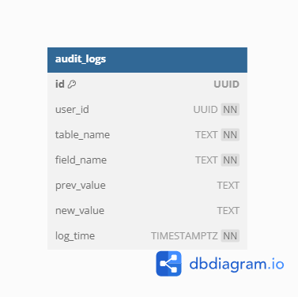
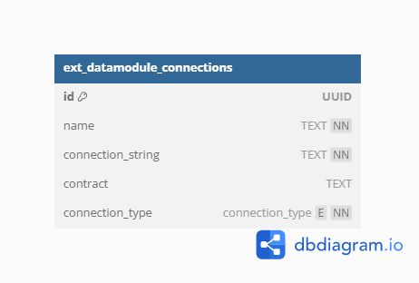
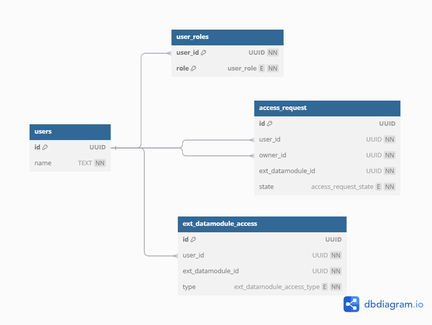
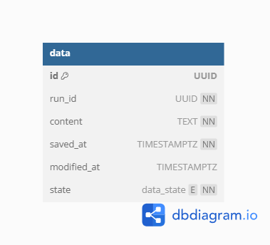
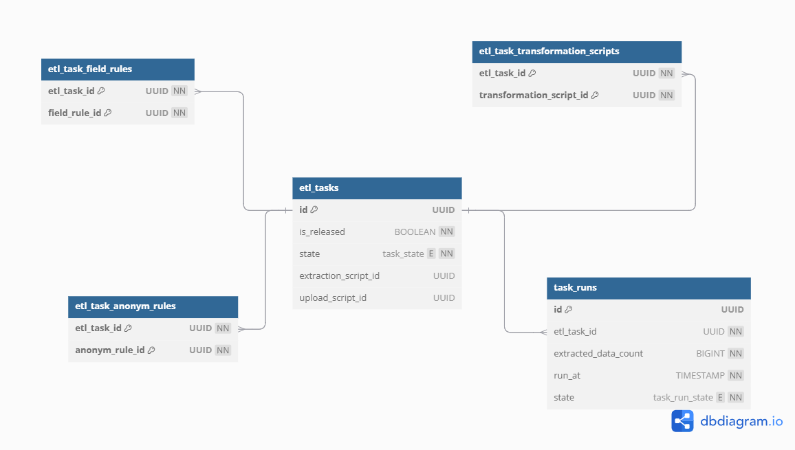

## Components


## AUDIT LOGGER



```sql
CREATE EXTENSION IF NOT EXISTS "uuid-ossp";

CREATE TABLE audit_logs (
    id UUID PRIMARY KEY DEFAULT uuid_generate_v4(),
    user_id UUID NOT NULL,
    table_name TEXT NOT NULL,
    field_name TEXT NOT NULL,
    prev_value TEXT,
    new_value TEXT,
    log_time TIMESTAMPTZ NOT NULL DEFAULT NOW()
);
```

## ExtDatamodule MANAGER



```sql
CREATE EXTENSION IF NOT EXISTS "uuid-ossp";

CREATE TYPE connection_type AS ENUM ('gRPC', 'Http', 'database');

CREATE TABLE ext_datamodule_connections (
    id UUID PRIMARY KEY DEFAULT uuid_generate_v4(),
    name TEXT NOT NULL,
    connection_string TEXT NOT NULL,
    contract TEXT,
    connection_type connection_type NOT NULL
);
```

## USER MANAGER



```sql
CREATE EXTENSION IF NOT EXISTS "uuid-ossp";

CREATE TYPE access_request_state AS ENUM ('Wait', 'Approved', 'Declined');
CREATE TYPE user_role AS ENUM ('EditTask', 'ManageData', 'CreateExtDatamodule', 'ProcessEtlTask');
CREATE TYPE ext_datamodule_access_type AS ENUM ('Read', 'Write', 'Owner');

CREATE TABLE users (
    id UUID PRIMARY KEY DEFAULT uuid_generate_v4(),
    name TEXT NOT NULL
);

CREATE TABLE user_roles (
    user_id UUID NOT NULL REFERENCES users(id) ON DELETE CASCADE,
    role user_role NOT NULL,
    PRIMARY KEY (user_id, role)
);

CREATE TABLE ext_datamodule_access (
    id UUID PRIMARY KEY DEFAULT uuid_generate_v4(),
    user_id UUID NOT NULL REFERENCES users(id) ON DELETE CASCADE,
    owner_id UUID NOT NULL REFERENCES users(id),
    ext_datamodule_id UUID NOT NULL,
    type ext_datamodule_access_type NOT NULL
);

CREATE TABLE access_request (
    id UUID PRIMARY KEY DEFAULT uuid_generate_v4(),
    user_id UUID NOT NULL REFERENCES users(id) ON DELETE CASCADE,
    ext_datamodule_id UUID NOT NULL,
    state access_request_state NOT NULL DEFAULT 'Wait'
);

```

## DATA MANAGER



```sql
CREATE EXTENSION IF NOT EXISTS "uuid-ossp";

CREATE TYPE data_state AS ENUM ('Created', 'Modified', 'Sent');

CREATE TABLE data (
    id UUID PRIMARY KEY DEFAULT uuid_generate_v4(),
    run_id UUID NOT NULL,
    content TEXT NOT NULL,
    saved_at TIMESTAMPTZ NOT NULL DEFAULT NOW(),
    modified_at TIMESTAMPTZ,
    state data_state NOT NULL DEFAULT 'Created'
);
```

## ETL-TASK MANAGER




```sql
CREATE EXTENSION IF NOT EXISTS "uuid-ossp";

CREATE TYPE task_state AS ENUM ('Draft', 'Released', 'Completed');
CREATE TYPE task_run_state AS ENUM ('Running', 'Paused', 'Stopped');

CREATE TABLE etl_tasks (
    id UUID PRIMARY KEY DEFAULT uuid_generate_v4(),
    is_released BOOLEAN NOT NULL DEFAULT FALSE,
    state task_state NOT NULL DEFAULT 'Draft',
    extraction_script_id UUID,
    upload_script_id UUID,
    CONSTRAINT etl_tasks_state_check CHECK (state IN ('Draft', 'Released', 'Completed'))
);

CREATE TABLE etl_task_field_rules (
    etl_task_id UUID NOT NULL REFERENCES etl_tasks(id) ON DELETE CASCADE,
    field_rule_id UUID NOT NULL,
    PRIMARY KEY (etl_task_id, field_rule_id)
);

CREATE TABLE etl_task_anonym_rules (
    etl_task_id UUID NOT NULL REFERENCES etl_tasks(id) ON DELETE CASCADE,
    anonym_rule_id UUID NOT NULL,
    PRIMARY KEY (etl_task_id, anonym_rule_id)
);

CREATE TABLE etl_task_transformation_scripts (
    etl_task_id UUID NOT NULL REFERENCES etl_tasks(id) ON DELETE CASCADE,
    transformation_script_id UUID NOT NULL,
    PRIMARY KEY (etl_task_id, transformation_script_id)
);

CREATE TABLE task_runs (
    id UUID PRIMARY KEY DEFAULT uuid_generate_v4(),
    etl_task_id UUID NOT NULL REFERENCES etl_tasks(id) ON DELETE CASCADE,
    extracted_data_count BIGINT NOT NULL DEFAULT 0,
    run_at TIMESTAMP WITH TIME ZONE NOT NULL DEFAULT NOW(),
    state task_run_state NOT NULL DEFAULT 'Running'
);
```

## SCRIPTS MANAGER

## COMMON

```json
{
  "_id": UUID("..."),
  "type": "TYPE",   // Extraction, FieldRule, AnonymizationRule, Transformation, Uploading
  "released": false,
  "fields": [ 
    { "source": "ext_datamodule_id_1", "name": "fieldName1" },
    { "source": "ext_datamodule_id_2", "name": "fieldName2" }
  ],
  ...
}
```

## Field Rule
```json
{
    ...
    "fieldRuleType": "TYPE",     // FillEmpty, IgnoreEmpty, RemoveEmpty, FillOutOfRange, IgnoreOutOfRange, RemoveOutOfRange
    "defaultValue": {...},            
    "minValue": {...},                
    "maxValue": {...},                
    "fieldType": "string indicating type"
}
```

## Anonymization Rule

```json
{
    ...
    "anonymizationRuleType": "Type"   //  Generalization,  Suppression, Anatomization, Permutation, Pertubation

}
```

## Transformation

```json
{
    ...
    "transformationType": "Type",   //  Merge, Update
    "transformationScript": "string or null"
}
```

## Common scripts examples

### Get by id:

```js
const script = db.processing_scripts.findOne({_id: UUID("...")});
```

### Get by type:

```js
db.processing_scripts.find({type: "TransformationScript"});
```

### Get released:

```js
db.processing_scripts.find({released: true});
```
