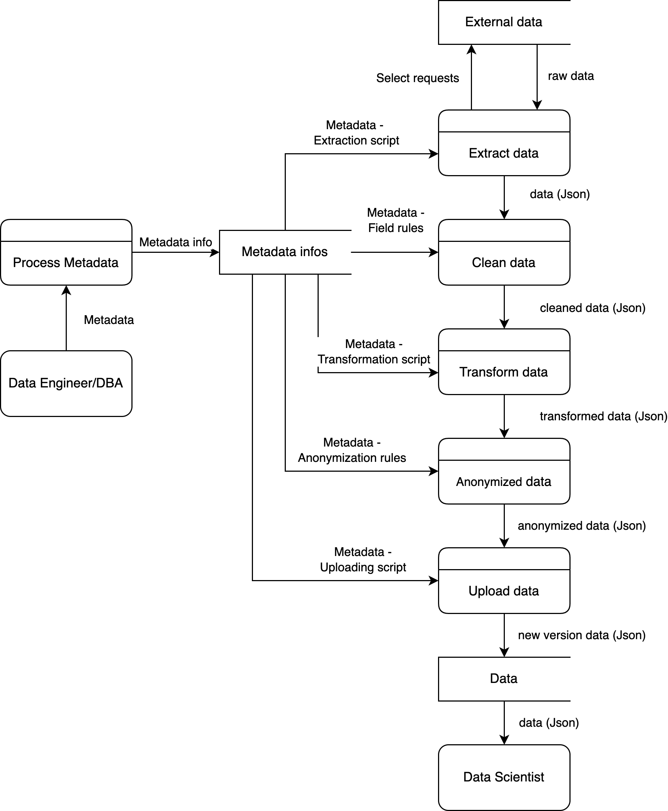

# Task - 3
### Team: ETL-Express

## Description:

```
Develop product requirements. Follow these steps:

Prepare product scope and feature hypotheses (Task 2)
Conduct a JTBD interview with another team to understand customer journey
Analyze the results and make corrections to the product
Obtain a feedback from the other team using a “paper” prototype of the product
Finalize features and jobs for the product (storymap), develop a report and work products
```

## Roles

### Data engineer

#### Description:


Alexei, a 27-year-old data engineer based in Moscow, works at a big e-com company. With a Master's degree in Computer Science from Higher School of Economics, Alexey works as a data engineer in a large e-com company. He earns 350,000₽ per month.
Alexei's primary focus is on efficiently processing and cleaning large volumes of transactional data for downstream analytics. His main motivation is to automate data pipelines to reduce manual workload and enhance data quality. Now he is facing a number of challenges: he spends an excessive amount of time on manual data cleaning, struggles with inconsistent data formats, and finds it difficult to integrate data from multiple sources.
Alexei discovers a new ETL service that automates data extraction, transformation, and anonymization. By implementing this solution, he streamlines his workflows, enabling him to focus on more strategic tasks like optimizing data models.


### Data scientist

#### Description:


Svetlana, a 29-year-old data scientist based in Saint Petersburg, works at a healthcare startup. With a PhD in Data Science from Moscow State University, Svetlana is deeply committed to advancing her field by developing predictive health models. She earns 300,000₽.
Svetlana's key need is access to high-quality, anonymized patient data that allows her to create accurate and reliable predictive models for healthcare. Her main motivation is to minimize the time spent on data preprocessing, so she can focus more on developing and refining algorithms. However, she encounters several challenges: she often works with incomplete or disorganized datasets and has considerable concerns about adhering to data privacy regulations.
Svetlana adopts a new ETL service designed to provide clean and anonymized datasets. This solution reduces her data preparation time and ensures compliance with privacy laws, allowing her to accelerate the development of predictive models and focus on her core expertise.


### Database administrator

#### Description:


Dmitry, a 35-year-old database administrator from Novosibirsk, works at a big e-com company. He holds a Master's degree in Information Systems from Moscow Institute of Physics and Technology. He earns 400,000₽ per month.
Dmitry's primary need is to ensure that sensitive customer data stored in databases is securely anonymized and efficiently prepared for analytics without the need for manual intervention. His main motivation is to automate data anonymization and transformation processes to comply with data privacy laws, while maintaining optimal database performance. He faces several challenges: he is overwhelmed by manual processes required for data masking and anonymization.
Dmitry discovers an ETL service that automates data extraction, anonymization, and loading processes. By integrating this service with his existing PostgreSQL databases, he successfully automates the anonymization of sensitive data, ensuring regulatory compliance. This solution also frees up his time to concentrate on enhancing database performance and security.


## Value proposition


## Story map


## Data flow diagram




## Data Glossary

1. **Data Source** - The origin from which data is extracted. Data sources can include databases, files, APIs, or other systems within the corporate infrastructure. The metadata specifies how to connect to and extract data from these sources using extraction scripts.

1. **Data Module** - A packaged unit of processed data that includes both the data itself and associated metadata. Data modules are stored in a relational database management system (RDBMS) like PostgreSQL or in S3 storage. Each data module is versioned and contains metadata compatible with JSON-LD, detailing the structure and processing rules of the data.

1. **Metadata** - Descriptive information associated with a data module that defines how data should be processed by the service. Metadata includes compulsory elements like table and column names, data types, null value handling strategies, and optional elements like value ranges. It also specifies scripts for data extraction and upload, and strategies for handling primary and foreign keys.

1. **Data Module Version** - A version identifier within the data module that tracks changes over time. Each time data is processed and the upload script is executed, the version number is updated. This allows users to reference specific iterations of the data module.

1. **Extraction script** - a script specified in the metadata as the script run by the service that produces records in the Pandas DataFrame form retrieved from an external database.

1. **Field (Column) rules** - information provided in the metadata related to the tables and columns used in the data module. This includes compulsory elements like table and column names, column data types, and null value handling strategies per column, as well as optional elements like value ranges for validation.

1. **Anonymization rules** - rules that are provided in the metadata for the table, which describe the process of data transformation to protect confidential data.

1. **Transformation script** - a script provided in the metadata for a specific table that describes the process of transforming data into a single data format.

1. **Upload script** - a script specified in the metadata file, run when the cleansing and anonymization of the data is complete, which puts the data into an external permanent storage(file or database) and updates the extraction script and data module version so that the cleansed data is now retrieved.