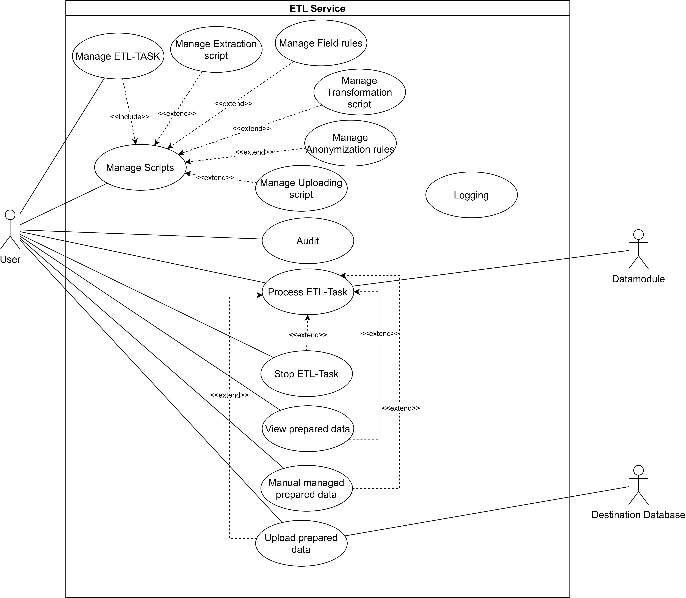

# ETL-Express 

> ETL service that helps to deliver data from corporate systems to MLOps framework.

## Use cases

### Use Case 1: Manage Scripts
**Description:** The user manages all types of scripts required for ETL processing, including creating, updating, and configuring Extraction scripts, Field Rules, Transformation scripts, Anonymization rules, and Uploading scripts.

- **Primary Actor:** User
- **Goals:** Create and manage scripts for extraction, field rules application, transformation, anonymization, and uploading
- **Pre-conditions:** User must be logged into the service
- **Post-conditions:** Scripts are created or updated successfully, ready for use in ETL tasks

**Basic flow:**
1. User navigates to the script management section in the ETL service interface.
2. System presents options to create a new script or edit an existing one.
3. User selects the type of script they wish to create or modify.
4. System displays relevant fields for defining or updating the script properties.
5. User completes all required fields, specifying extraction details, transformation logic, anonymization parameters, or upload rules as needed.
6. User saves the scripts configuration.
7. System validates the input and saves the scripts in the database, confirming its readiness for integration into ETL task.

---

### Use Case 2: Manage ETL Task
**Description:** User creates and configures an ETL task, which includes adding scripts created in the Manage Scripts use case.

- **Primary Actor:** User
- **Goals:** Create, configure, and update ETL tasks by adding relevant scripts
- **Pre-conditions:** User must be logged into the service
- **Post-conditions:** ETL task is created or updated with all necessary scripts, ready for execution

**Basic flow:**
1. User selects the option to create a new ETL task or update an existing one.
2. System presents a form to configure ETL task details.
3. User provides the basic task configuration.
4. User selects and attaches relevant scripts (Extraction script, Field Rules, Transformation scripts, Anonymization rules, Uploading script) from the list of available scripts.
5. User finalizes and saves the ETL task.
6. System validates the task setup, ensuring all necessary scripts are included, and saves the task configuration.

**Alternate path:**
- **Missing Scripts:** If required scripts are not attached, the system prompts the user to complete the setup by attaching necessary scripts before saving.

---

### Use Case 3: Process ETL Task
**Description:** The system processes an ETL task, involving data extraction, cleaning, transformation, anonymization, and preparation for uploading.

- **Primary Actor:** System
- **Goals:** Execute ETL processing, prepare data for eventual upload
- **Pre-conditions:** ETL task is fully configured and validated
- **Post-conditions:** Data is processed and stored in Outbox, awaiting user confirmation for upload

**Basic flow:**
1. System initiates the ETL task by executing the configured Extraction script to pull data from the specified data module.
2. System applies Field Rules to clean and standardize data fields.
3. System runs the Transformation script, performing data merging or other required transformations.
4. System applies Anonymization rules, using designated methods to anonymize each data field.
5. System saves the processed data in the Outbox database, pending user review and confirmation for upload.

**Alternate path:**
- **Processing Error:** If an error occurs at any stage, the system logs the error and informs user, and stopped executing.

---

### Use Case 4: Stop ETL Task
**Description:** User can pause or completely stop an ETL task. If stopped, the user can choose to clear Outbox and any partially sent data to the destination service.

- **Primary Actor:** User
- **Goals:** Pause or terminate an active ETL task
- **Pre-conditions:** ETL task is in progress
- **Post-conditions:** ETL task is paused or terminated, and data in the Outbox may be cleared if chosen

**Basic flow:**
1. User selects the option to stop or pause the ETL task.
2. System pauses or canceles the ongoing ETL task.
3. If the task is terminated, the system prompts the user to confirm the deletion of data in Outbox and any partially sent data in the destination service.
4. User confirms, and the system clears Outbox and destination if necessary.

---

### Use Case 5: View Prepared Data
**Description:** User reviews data that has been processed and saved in the Outbox.

- **Primary Actor:** User
- **Goals:** Access and review processed data
- **Pre-conditions:** Processed data is available in the Outbox
- **Post-conditions:** User can view data details stored in the Outbox

**Basic flow:**
1. User navigates to the Outbox section.
2. System displays a list of prepared data entries.
3. User selects a data entry to view details.
4. System presents the details of the selected data.

---

### Use Case 6: Manage Prepared Data
**Description:** User manages the processed data in the Outbox, with options to add, edit, or delete entries.

- **Primary Actor:** User
- **Goals:** Modify or manage prepared data entries in the Outbox
- **Pre-conditions:** Processed data entries are available in the Outbox
- **Post-conditions:** Data is updated, added, or removed as per user instructions

**Basic flow:**
1. User accesses the Outbox data management section.
2. System presents options to add, edit, or delete data entries.
3. User selects an action and modifies the data as needed.
4. System validates changes and updates Outbox accordingly.

---

### Use Case 7: Upload Prepared Data
**Description:** User decides to upload processed data from the Outbox to the destination. If no action is taken, data will be deleted automatically after a retention period.

- **Primary Actor:** User
- **Goals:** Confirm and initiate data upload from the Outbox
- **Pre-conditions:** Data is processed and available in the Outbox
- **Post-conditions:** Data is either uploaded to the destination or deleted based on user action

**Basic flow:**
1. User reviews the data in the Outbox and selects the option to upload.
2. System confirms the selection and initiates the upload process.
3. Data is transferred to the destination, and system updates Outbox to indicate completion.

---

### Use Case 8: Audit
**Description:** The system records all actions by users and the system itself, allowing users to review the history of changes and actions.

- **Primary Actor:** User
- **Goals:** Track and review audit logs for all actions
- **Pre-conditions:** Audit logs are enabled and accessible
- **Post-conditions:** User can view a detailed record of actions in the system

**Basic flow:**
1. User navigates to the audit log section.
2. System presents a searchable list of recorded actions.
3. User selects specific entries to view details.
4. System displays the action, timestamp, actor, and any relevant changes or results.

### Use Case 9: Login
**Description:** The system records all actions by users and the system itself, allowing users to review the history of changes and actions.

- **Primary Actor:** User
- **Goals:** Allow user to login into the system
- **Pre-conditions:** User is not logged in the system.
- **Post-conditions:** User is logged in the system.

**Basic flow:**
1. User navigates to the log section.
2. User enters own credantials.
3. System sends the user's creadantials to the external SSO.
4. System receives the external SSO's answer
4. User can use the system.