# Task - 4
### Team: ETL-Express

## Description:

```
Solve static modeling tasks using UML2 and ER diagrams.

The first student who solves a task, consults the professor, and if the solution is OK, writes down the solution on the whiteboard and receives an individual point.
```

## Task - 1

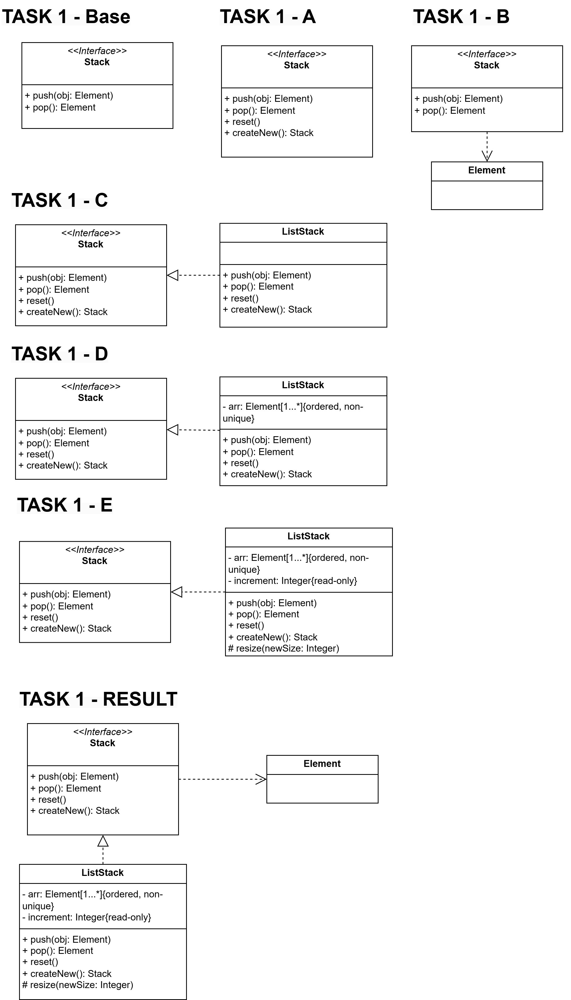

## Task - 2

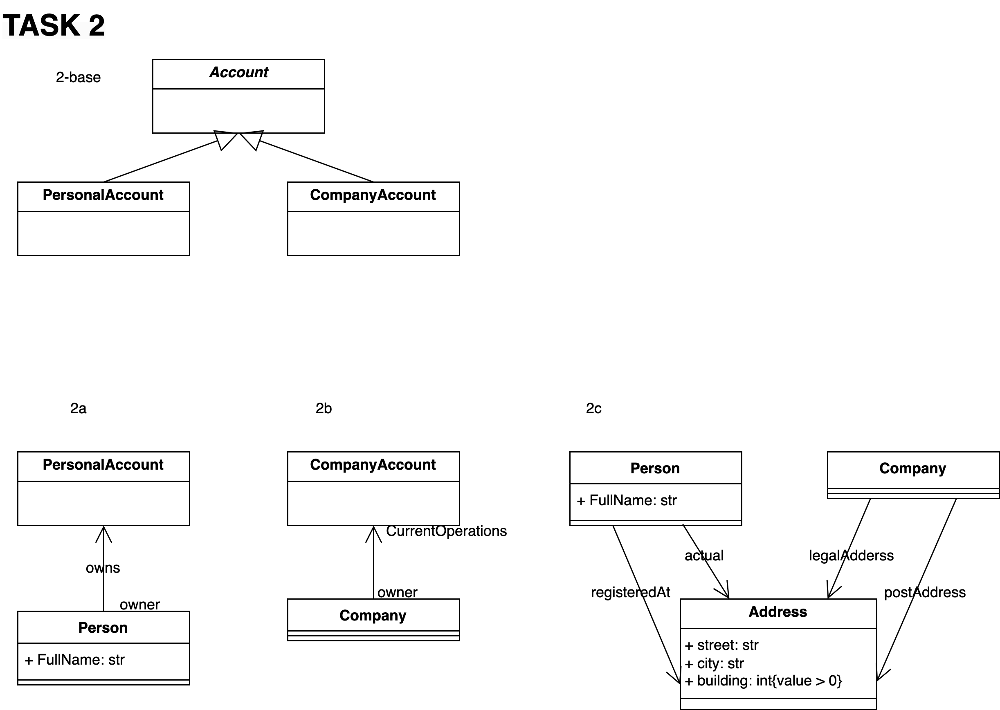

## Task - 3 - Base


## Task - 3 - A

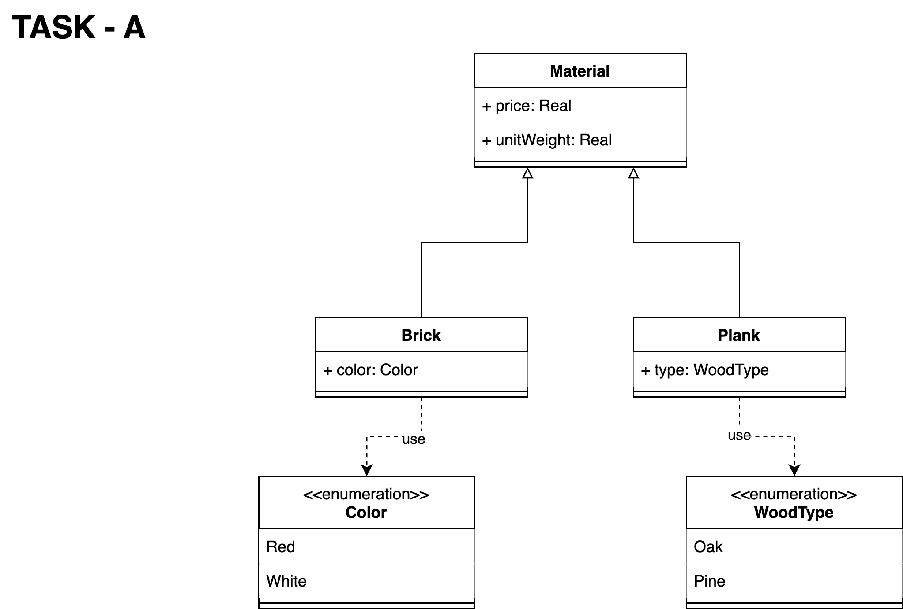

## Task - 3 - B

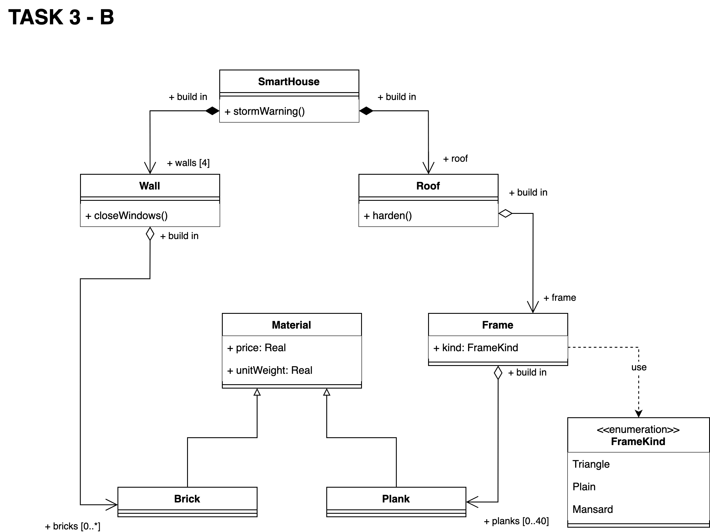

## Task - 3 - C

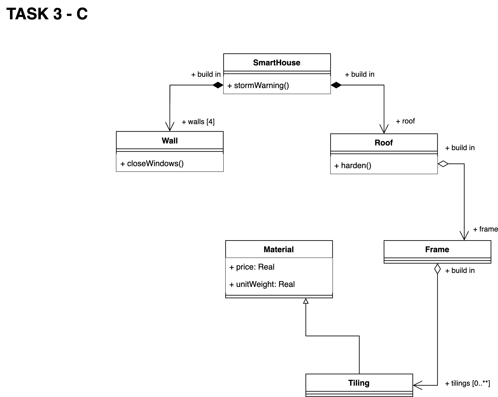

## Task - 3 - C (Result)

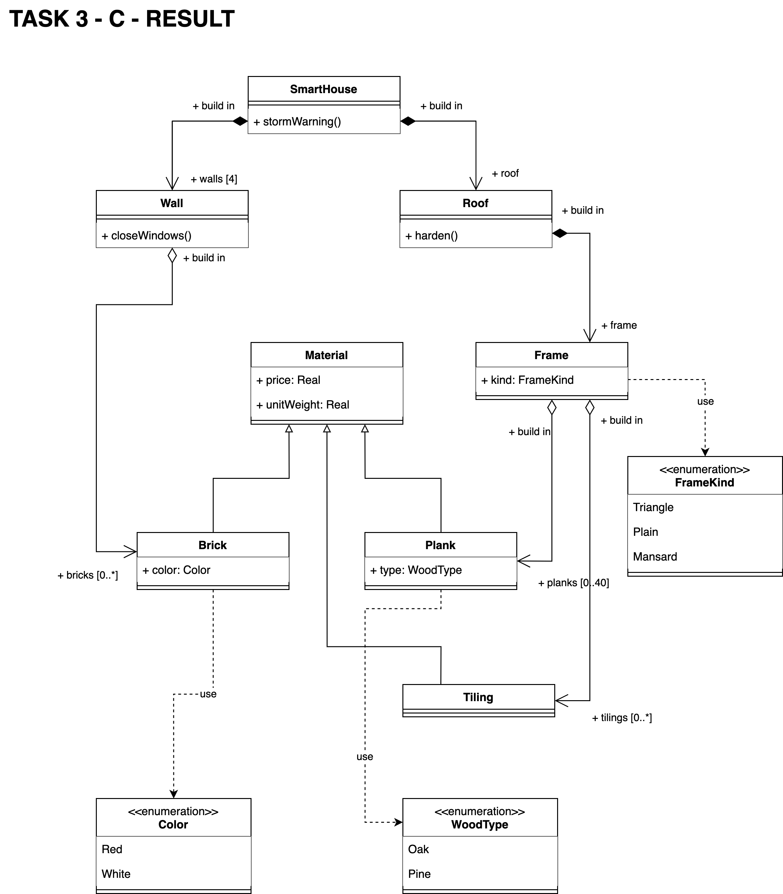

## Task - 3 - D


If we imagine that the universal material is equivalent to the use of each material, namely brick, plank and tile. Then let one wall require X bricks, where X >= 0, the roof can be covered with Y planks, where 0 <= Y <= 40, the roof can also be covered with tilings and let its quantity be M, where M >= 0, let the quantity of the universal material be N, then we get the following: N = 4*X + Y + M
Example: let X = 10, Y = 40, M = 80, then N = 4*10 + 40 + 80 = 160

## Task - 4

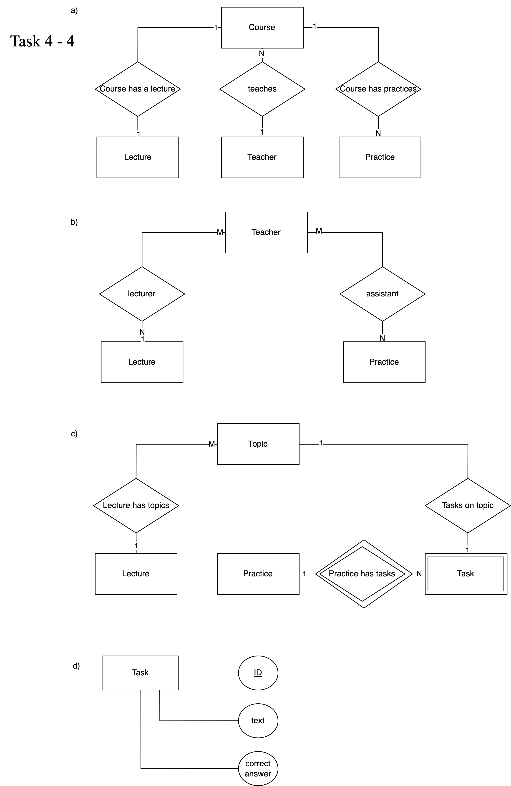

## Task - 5

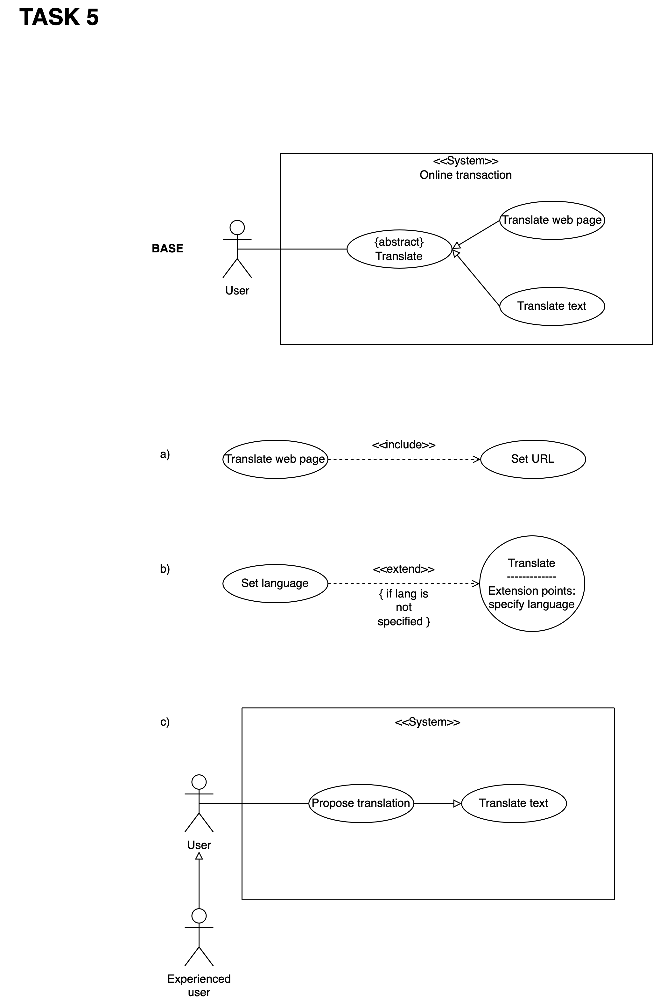

## Task - 6 - Base

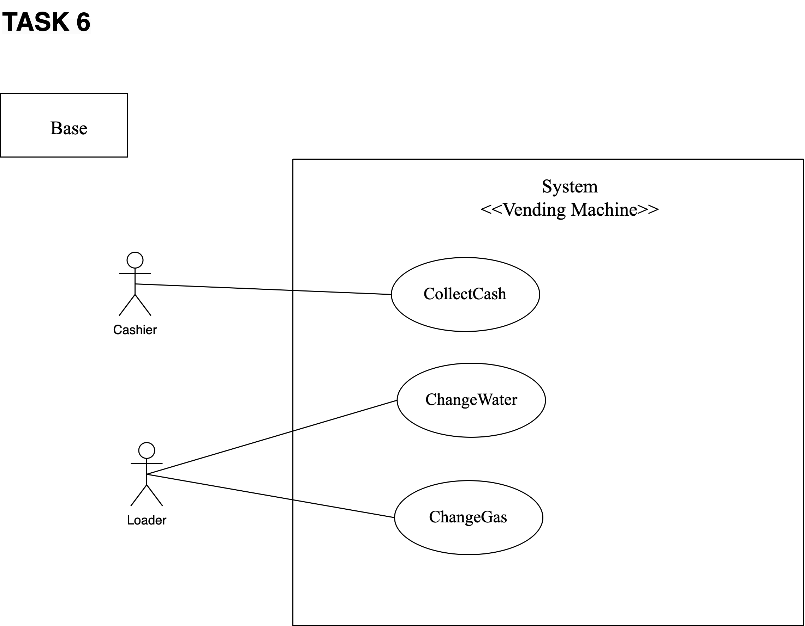

## Task - 6 - A

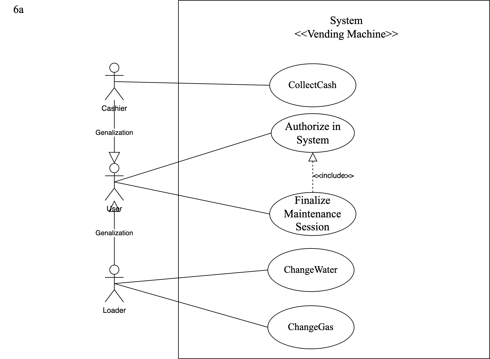

## Task - 6 - B

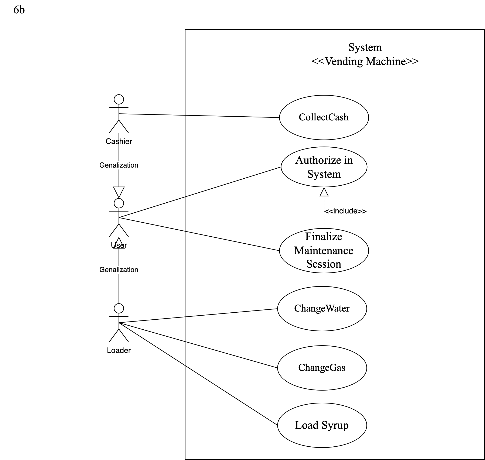

## Task - 6 - C

**Solution:**
The Cashier can replace the water tank in certain cases, such as:

**Emergency mode:** When the Loader is unable to perform their task due to absence or other urgent reasons, the system can temporarily grant the Cashier permission to replace the water tank to ensure the vending machine continues to operate.

**Dual Role:** If the Cashier has been trained and has additional access, they can replace the water tank.

## Task - 6 - D

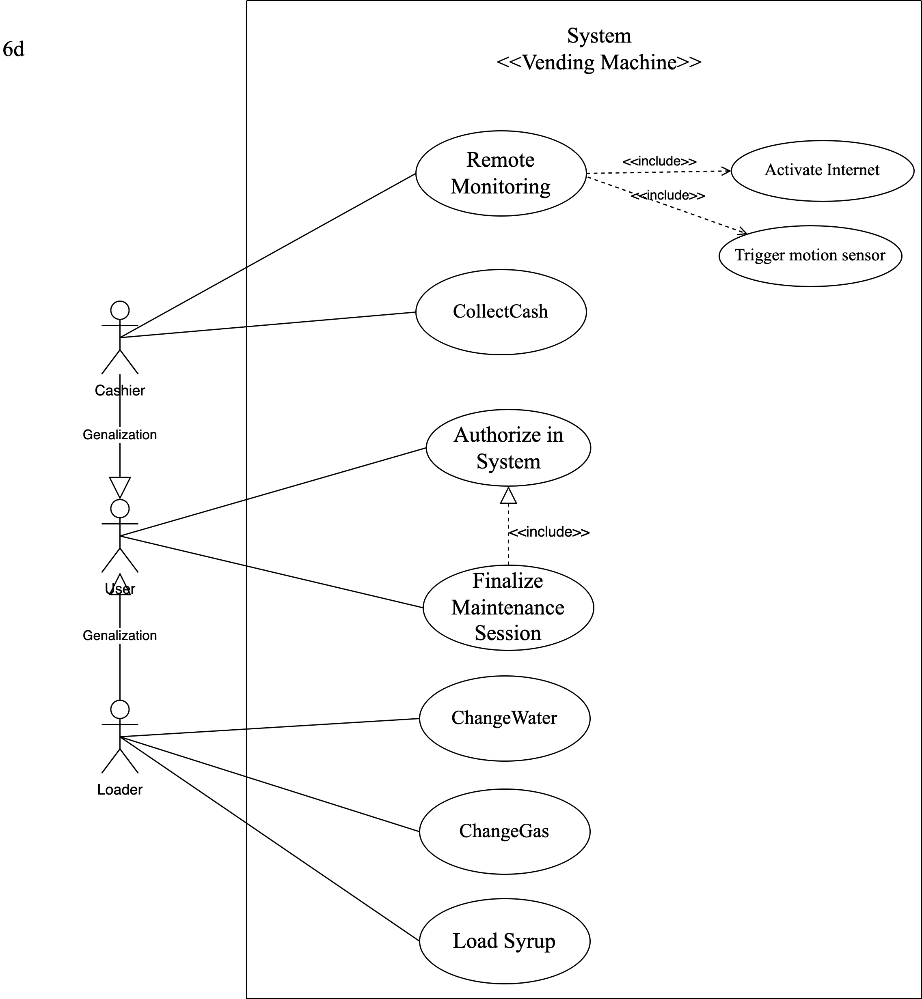

Explanation of the solution:
The Cashier, after authentication, can monitor the vending machine remotely via the Internet in real-time, or the camera can record video when the Cashier is unable to supervise, triggered by motion sensors. This is done through the following steps:
	Motion Sensor Activation: The sensor detects motion near the vending machine and activates the video camera.
	Remote Monitoring: The camera system connects to the Internet, allowing the Cashier to monitor the machine's activity remotely on mobile devices or computers.
