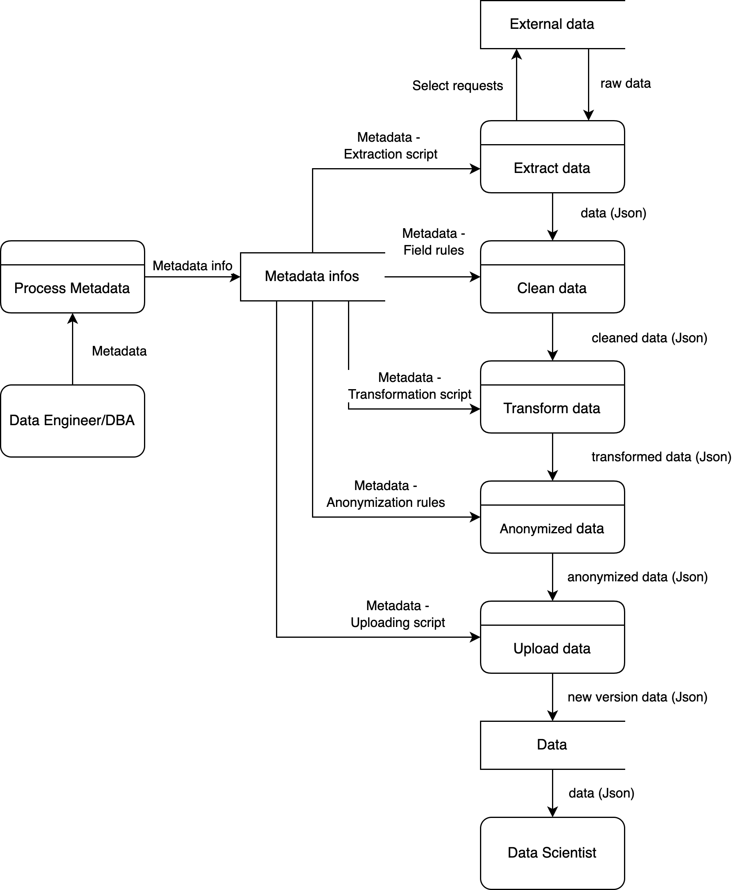
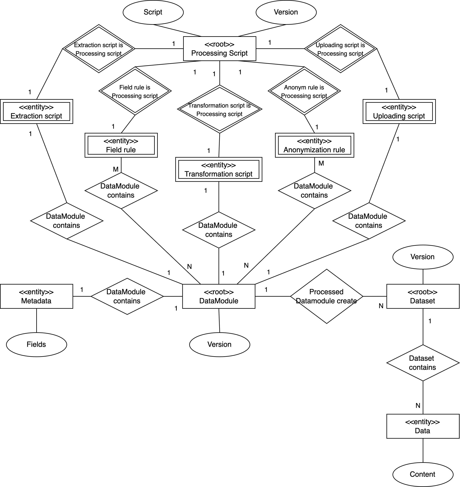
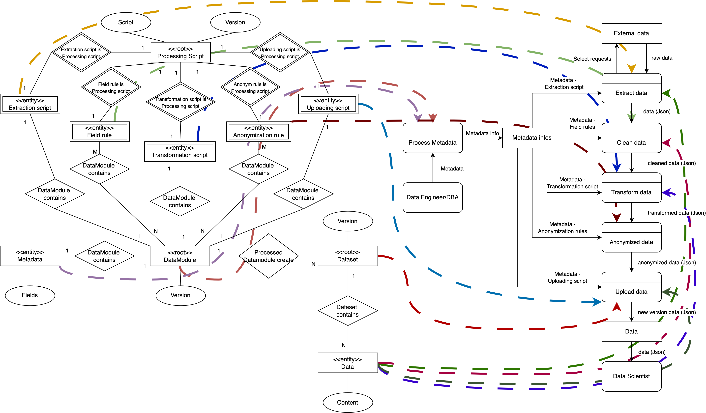

# Task - 5
### Team: ETL-Express

## Description:

```
Develop an analysis model for your product. Use features and stories from Task 3 as a source of requirements.

Note: if you had “wrong scope” taint for the previous task you are strongly advised to talk to your professor.

Optional extra: discuss, explain and get feedback on your requirements from the HSE MLOps team or AI Center Framework team (your customers).

Overall process:

Detail use cases for job/user stories. 
A rule of thumb: function/user level Use case <=> user/job story in product (business) requirements

Build a Glossary of candidate classes with either Abbot’s methods, checklists or both based on use cases, stories, features. Check for duplicates

Use “SIAOUT” criteria to classify them as attributes, classes, values. Extract operations and relations as verbs and/or communication/interaction acts.

Draw a draft class model from 2. and 3.

Assign DDD stereotypes to classes from 4.
```

## Use case - common diagram


## Use case - update script diagram


## Use case - update datamodule diagram


## Use case - get dataset verison diagram


## Class candidates

| Candidate             | Criteria | Stored information         | Operations  |
| --------------------- | -------- | -------------------------- | ----------- |
| Metadata              | SU       | Fields                     |             |
| Data module           | SUT      | Version, Metadata, Scripts | Process     |
| Processing script     | SAUT     | Script, Version            | Run, Update |
| Extraction script     | SAUT     | Script, Version            | Run, Update |
| Field rule            | SAUT     | Script, Version            | Run, Update |
| Transformation script | SAUT     | Script, Version            | Run, Update |
| Anonymization rule    | SAUT     | Script, Version            | Run, Update |
| Uploading script      | SAUT     | Script, Version            | Run, Update |
| Dataset               | S        | Data                       |             |
| Data                  | ST       | Content                    |             |

## Data flow diagram



## Entity-Relationship diagram



## ERD + DFD


