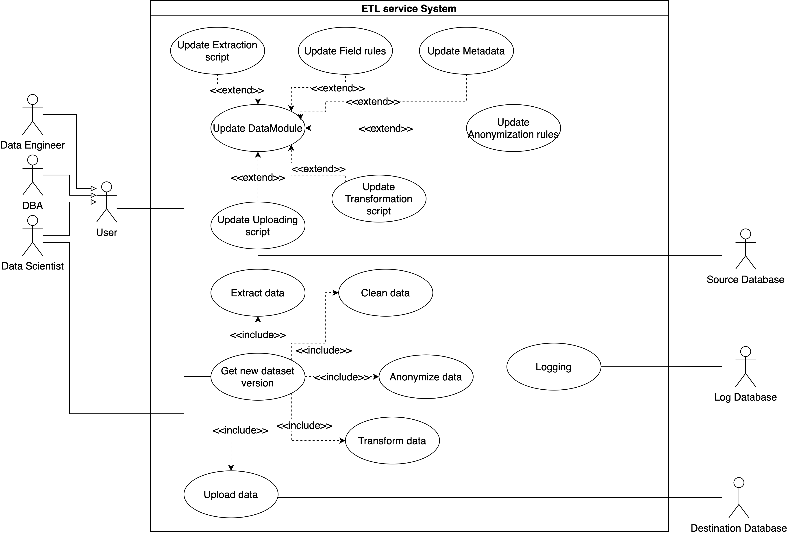
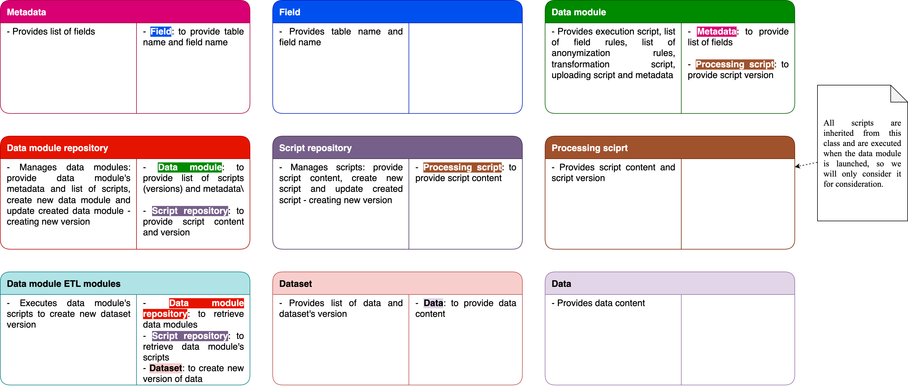

# Task - 6
### Team: ETL-Express

## Description:

```
Develop an interaction model for your product. Use use cases from Task 5 and apply CRC modeling technique to devise collaborations and interaction sequences.

Overall process:
Make a list of high priority Use Cases and candidate classes
Apply a CRC role-playing method to elaborate class interactions within the system. Write down the responsibilities of each participating class. Introduce new classes/roles whenever necessary.
Build a cooperations table to indicate which classes participate in which use cases. Update class diagram if needed
Check that DDD stereotypes are up to date.

```

## Use case - common diagram



## Use case - update script diagram


## Create script. Scenario

1.1. User enters the system and creates a script.

1.2. Then the system creates a draft of script.


2.1. The user writes script content, script itself.

2.2. The system validate script content.


3.1. The user releases the script version.

3.2. The system writes the version of script and marks it as ready for use.


## Update script. Scenario

1.1. User enters the system and starts update a created script.

1.2. Then the system creates a draft of script.


2.1. The user updates script content, script itself.

2.2. The system validate script content.


3.1. The user releases the script version.

3.2. The system writes the version of script and marks it as ready for use.


## Use case - update datamodule diagram


## Create data module. Scenario

1.1. User enters the system and creates a data module.

1.2. Then the system creates a draft of data module.


2.1. The user chooses which scripts should be executed, when the data module is processed.

2.2. The system adds the chosen scripts to data module.


3.1. The user releases the data module version.

3.2. The system writes the version of data module and marks it as ready for use.


## Update data module. Scenario

1.1. User enters the system and starts update a created data module.

1.2. Then the system creates a draft of data module.


2.1. The user chooses which scripts should be executed, when the data module is processed.

2.2. The system adds the chosen scripts to data module.


3.1. The user releases the data module version.

3.2. The system writes the version of data module and marks it as ready for use.


## Use case - get dataset verison diagram


## Get new dataset version. Scenario

1.1. User enters the system and launches a data module.

1.2. The system then receives the data module metadata and processing scripts.

1.3. The system extracts data using extraction script extract data from external data sources and passes the data on for further processing.

1.4. The system applies field rules and cleans up the received data.

1.5. The system then applies anonymization scripts to the cleaned data.

1.6. Then the system converts the anonymized data to a single format using a transformation script.

1.7. The system upload data to new dataset version using uploading script.


## Class candidates

| Candidate               | Criteria | Stored information         | Operations                               |
| ----------------------- | -------- | -------------------------- | ---------------------------------------- |
| Metadata                | SU       | Fields                     |                                          |
| Field                   | S        | Table name, field name     |                                          |
| Data module Repository  | UT       |                            | Get, Update, Create (data modules)       |
| Data module ETL Modules | UT       |                            | Execute data module                      |
| Data module             | SUT      | Version, Metadata, Scripts | Process                                  |
| Script Repository       | UT       |                            | Get, Update, Create (processing scripts) |
| Processing script       | SAUT     | Script, Version            | Run, Update                              |
| Extraction script       | SAUT     | Script, Version            | Run, Update                              |
| Field rule              | SAUT     | Script, Version            | Run, Update                              |
| Transformation script   | SAUT     | Script, Version            | Run, Update                              |
| Anonymization rule      | SAUT     | Script, Version            | Run, Update                              |
| Uploading script        | SAUT     | Script, Version            | Run, Update                              |
| Dataset                 | S        | List of Data, version      |                                          |
| Data                    | ST       | Content                    |                                          |

## CRC




## Copperations table

| Use case                | Cooperation Name             | Used Roles     | Candidate classes                                                                                                                                                                                                               |
| ----------------------- | ---------------------------- | -------------- | ------------------------------------------------------------------------------------------------------------------------------------------------------------------------------------------------------------------------------- |
| Create script           | Script creating              | User           | Script repository, processing script                                                                                                                                                                                            |
| Update script           | Script updating              | User           | Script repository, processing script                                                                                                                                                                                            |
| Create data module      | Data module creating         | User           | Data module repository, data module, metadata, fields, script repository, processing script, extraction script, transformation script, uploading script, field rule, anonymization rule                                         |
| Update data module      | Data module updating         | User           | Data module repository, data module, metadata, fields, script repository, processing script, extraction script, transformation script, uploading script, field rule, anonymization rule                                         |
| Get new dataset version | Creating new dataset version | Data scientist | Data module ETL modules, dataset, data, data module repository, data module, metadata, fields, script repository, processing script, extraction script, transformation script, uploading script, field rule, anonymization rule |

## Class diagram


