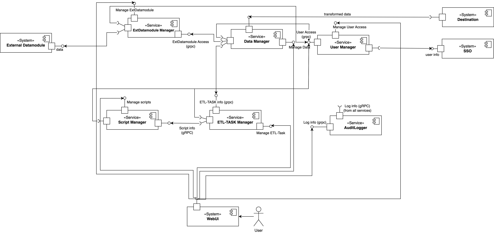
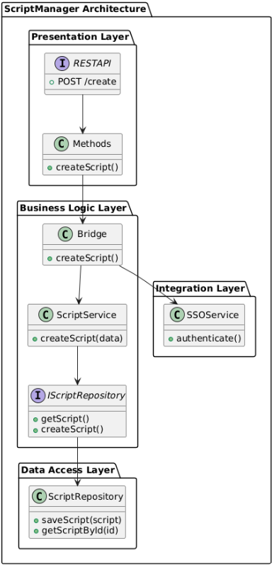
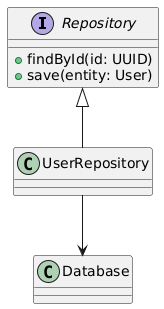
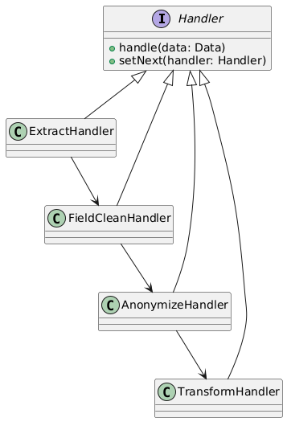
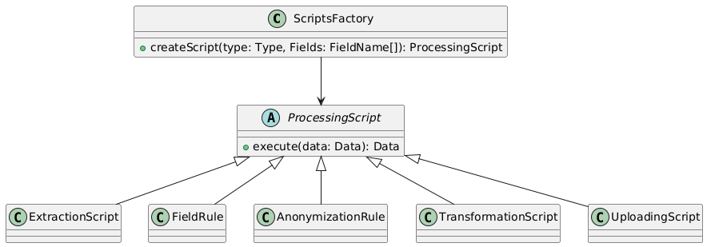
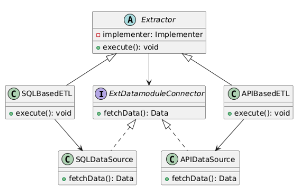

# Task - 12
### Team: ETL-Express

## Slides : [presentation](https://docs.google.com/presentation/d/183ClkUcGv5YaY4f9ODb_svtOeJdDW2IOoWRuvsI7jmM/edit?usp=sharing)
## Videos : [video](https://drive.google.com/file/d/1XBlCA0aInMci7yNLdOGXVc9exdC3i-Lz/view?usp=sharing)

## Description:

```
Final task 2 - due 22/12/2024
This is the final task for Module 2. The goal is to compose a full report out of fixed tasks 9-10 and 11-12.

That is, do include previous results on the project after fixing mistakes.
Here is the template https://tiny.cc/asd-template-final-2 

Submission checklist

Structure of the slides follows the template
Repository and document storage contains the design, source code for the prototype, architectural drivers/principles, design cases, API yamls, class diagrams with DDD / ER model for each microservice, from final task 1: features, personas, jobs, storymap, use cases texts and diagrams, interactions table or collaboration diagrams, responsibilities table
There are links to the source material in the repo/storage on the slides 
For each microservice you can explain which use cases it participates in
For each domain class there is a use case or job/user story it implements
For each API method you can explain corresponding use case steps / story
For each DB instance you provide a physical schema
There are at least 1 microservice, API endpoint, detailed design case and db schema per team member
There is an implemented and deployed prototype.

In case your project does not satisfy the sizing constraints, do elaborate your requirements first then extend the design to accommodate for requirements!

Video report is mandatory for the final task 2.

Overall grading criteria for the final task 2.

Excellent grade (10/12)

Project contains no errors, has all parts, and is larger than required for the team size.
Team successfully defended the project, and members’ contributions are clearly stated.


Good grade (8/12)

Project contains no major errors, has all parts, and is large enough for the team size.
Team is able to answer questions on the project, and members’ contributions are clearly stated.


Satisfactory grade (6/12)

Project contains no major errors, has most parts, may not be as large as needed for the team size. Team is able to answer questions on the project, and members’ contributions are not clearly stated.


Failed grade (<=4)

Project contains major errors, missing many parts, too small for the team.
Team cannot answer questions on the project or members’ contributions are not clearly stated.
```

## Use-cases


### Use Case: Login

**Description:** The user logs into the ETL service using an external Single Sign-On (SSO) system for authentication.

1. **Primary Actor:** User
1. **Goals:** Gain authorized access to the ETL service
1. **Pre-conditions:** User has valid credentials with the external SSO provider
1. **Post-conditions:** User is authenticated and granted access to the ETL service's functionalities

**Basic Flow:**

1. **Access Login Page:**
   1. User navigates to the ETL service login page.
   1. System displays the login interface.
2. **Redirect to SSO Provider:**
   1. User selects the option to log in via the external SSO provider.
   1. System redirects the user to the SSO provider's authentication page.
3. **Authenticate with SSO:**
   1. User enters their SSO credentials and submits.
   1. SSO provider authenticates the user.
4. **Return to ETL Service:**
   1. SSO provider redirects the user back to the ETL service with authentication tokens.
5. **Establish Session:**
   1. System validates the authentication tokens.
   1. System establishes a session for the user.
   1. User gains access to the ETL service's dashboard and features.

**Note:** Authentication is handled externally; no backend methods are invoked within the ETL service for this use case.

---

### Use Case: Manage Scripts

**Description:** The Task-Editor manages scripts required for ETL processing by utilizing the `ScriptManager` service, including creating, updating, releasing, and retrieving scripts.

1. **Primary Actor:** Task-Editor
1. **Goals:** Create, update, release, and manage scripts for extraction, field rules application, transformation, anonymization, and uploading
1. **Pre-conditions:** User must be logged into the service
1. **Post-conditions:** Scripts are created, updated, or released successfully, ready for use in ETL tasks

**Basic Flow:**

1. **Access Script Management:**
   1. Task-Editor navigates to the script management section in the ETL service interface.
2. **Check Permissions:**
   1. System verifies the Task-Editor's permissions to manage scripts.
   1. (Access verification may involve backend call) *(GetUser - UserManager)*
3. **View Script Options:**
   1. System presents options to create a new script or edit an existing one.
4. **Select Action:**
   1. Task-Editor chooses to create a new script or modify an existing script.
5. **Create New Script:**
   1. If creating, Task-Editor inputs script details such as type and properties.
   1. Task-Editor submits the new script.
   1. System processes the creation request.
   1. *(CreateScript - ScriptManager)*
6. **Edit Existing Script:**
   1. If editing, Task-Editor selects a script to modify.
   1. System retrieves script details.
   1. *(GetScript - ScriptManager)*
   1. Task-Editor updates the script information.
   1. Task-Editor submits the updates.
   1. System processes the update request.
   1. *(UpdateScript - ScriptManager)*
7. **Release Script:**
   1. Task-Editor may choose to release the script for use in ETL tasks.
   1. Task-Editor initiates the release action.
   1. System processes the release.
   1. *(ReleaseScript - ScriptManager)*
8. **Confirmation:**
   1. System confirms that the script is saved and ready for integration.
   1. Task-Editor receives confirmation message.

**Alternate Path:**

- **Validation Errors:**
  1. If the system detects invalid inputs, it informs the Task-Editor and prompts for corrections before proceeding.

---

### Use Case: Manage ETL Task

**Description:** The Task-Editor creates and configures an ETL task by using the `EtlTaskManager` service, including adding scripts via update methods.

1. **Primary Actor:** Task-Editor
1. **Goals:** Create, configure, and update ETL tasks by adding relevant scripts
1. **Pre-conditions:** User must be logged into the service
1. **Post-conditions:** ETL task is created or updated with all necessary scripts, ready for execution

**Basic Flow:**

1. **Access ETL Task Management:**
   1. Task-Editor navigates to the ETL task management section.
2. **Check Permissions:**
   1. System verifies Task-Editor's permissions to manage ETL tasks.
   1. *(GetUser - UserManager)*
3. **Create or Select Task:**
   1.  Task-Editor chooses to create a new ETL task or select an existing one to update.
   1.  If creating, Task-Editor provides basic task details and submits.
   1.  *(CreateTask - EtlTaskManager)*
   1.  If updating, Task-Editor selects the task to modify.
   1.  System retrieves task details.
   1.  *(GetTask - EtlTaskManager)*
4. **Configure Task Scripts:**
   1. Task-Editor attaches relevant scripts to the task:
     1. Adds or updates the Extraction script.
       1. *(UpdateExtractionScript - EtlTaskManager)*
     1. Adds or updates Field Rules.
       1. *(UpdateFieldRules - EtlTaskManager)*
     1. Adds or updates Anonymization rules.
       1. *(UpdateAnonymizationRules - EtlTaskManager)*
     1. Adds or updates Transformation scripts.
       1. *(UpdateTransformationScripts - EtlTaskManager)*
     1. Adds or updates Uploading script.
       1. *(UpdateUploadingScript - EtlTaskManager)*
5. **Finalize Configuration:**
   1. Task-Editor reviews the task setup.
   1. Task-Editor saves the task configuration.
6. **Release Task:**
   1. Task-Editor may release the task to make it ready for execution.
   1. *(Release - EtlTaskManager)*
7. **Confirmation:**
   1. System validates the task setup.
   1. System confirms the task is ready for execution.

**Alternate Path:**

1. **Missing Scripts:**
  1. If required scripts are not attached, system alerts Task-Editor to complete the setup before the task can be released.

---

### Use Case: Manage External Datamodule Connection

**Description:** The user creates and configures connections to external datamodules by using the `ExtDatamoduleManager` service.

1. **Primary Actor:** User
1. **Goals:** Establish and manage connections to external datamodules for data extraction or interaction
1. **Pre-conditions:** User must be logged into the service and have necessary permissions
1. **Post-conditions:** A new external datamodule connection is created or updated and saved, ready for use in ETL tasks

**Basic Flow:**

1. **Access Connection Management:**
   1. User navigates to the "Manage External Datamodule Connections" section.
2. **Check Permissions:**
   1. System verifies user's permissions to manage connections.
   1. *(GetUser - UserManager)*
3. **Create or Edit Connection:**
   1. User chooses to create a new connection or edit an existing one.
4. **Provide Connection Details:**
   1. User enters necessary information:
     1. Datamodule contract details.
     1. Connection string.
     1. Connection type (e.g., SQL, gRPC, API).
     1. Assigns owners for the connection.
5. **Submit Configuration:**
   1. User submits the connection configuration.
6. **Process Request:**
   1. System validates the input for correctness and conflicts.
   1. System saves the new or updated connection.
   1. *(CreateConnection or UpdateConnection - ExtDatamoduleManager)*
7. **Confirmation:**
   1. System confirms the connection is ready for use.
   1. Notifies assigned owners if applicable.

---

### Use Case: Get External Datamodule Access

**Description:** The user requests access to an existing external datamodule connection by sending a request to the connection's owners via the `UserManager` service.

1. **Primary Actor:** User
1. **Goals:** Obtain permission to use a specific external datamodule connection
1. **Pre-conditions:** User must be logged into the service; the connection exists
1. **Post-conditions:** An access request is sent to the connection's owners for approval

**Basic Flow:**

1. **View Available Connections:**
   1. User navigates to the list of external datamodule connections.
   1. System displays available connections with access status.
   1. *(GetAllConnection - ExtDatamoduleManager)*
2. **Select Connection:**
   1. User identifies a connection they need access to.
3. **Request Access:**
   1. User selects "Request Access" for the chosen connection.
   1. System prompts for reason or additional details.
4. **Submit Request:**
   1. User submits the access request.
   1. System records the request.
   1. *(AddAccess - UserManager)*
5. **Notify Owners:**
   1. System sends notification to the connection's owners.
6. **Confirmation:**
   1. User receives acknowledgment that the request has been sent.

---

### Use Case: Approve External Datamodule Access

**Description:** The connection owners review and approve or deny access requests from users via the `UserManager` service.

1. **Primary Actor:** Connection Owner
1. **Goals:** Manage access requests by approving or denying user requests
1. **Pre-conditions:** Connection owner must be logged into the service; pending access requests exist
1. **Post-conditions:** User access is granted or denied; requester is notified

**Basic Flow:**

1. **Receive Notification:**
   1. Connection owner is notified of a pending access request.
2. **Access Access Requests:**
   1. Owner navigates to the "Access Requests" section.
3. **Check Permissions:**
   1. System verifies owner's permissions for the connection.
   1. *(GetUser - UserManager)*
4. **Review Request:**
   1. System displays pending requests with details.
   1. Owner reviews the requester's information and reason.
5. **Make Decision:**
   1. Owner chooses to approve or deny the request.
6. **Submit Decision:**
   1. Owner submits their decision.
   1. *(ApproveAccessRequest - UserManager)*
7. **Update Permissions:**
   1. System updates access permissions accordingly.
8. **Notify Requester:**
   1. System sends notification to the requester with the decision.

---

### Use Case: Process ETL Task

**Description:** The Task-Manager initiates the processing of an ETL task by using the `EtlTaskManager` service, and the system executes the ETL processing steps.

1. **Primary Actor:** Task-Manager
1. **Goals:** Execute ETL processing, prepare data for eventual upload
1. **Pre-conditions:** ETL task is fully configured and validated
1. **Post-conditions:** Data is processed and stored, awaiting user confirmation for upload

**Basic Flow:**

1. **Initiate Task Processing:**
   1. Task-Manager selects an ETL task to process.
2. **Check Permissions:**
   1. System verifies Task-Manager's permissions.
   1. *(GetUser - UserManager)*
3. **Start ETL Task:**
   1. Task-Manager initiates the task processing.
   1. *(Start - EtlTaskManager)*
4. **Execute Extraction:**
   1. System runs the Extraction script to pull data.
5. **Apply Field Rules:**
   1. System applies Field Rules to clean and standardize data.
6. **Run Transformation:**
   1. System executes Transformation scripts.
7. **Apply Anonymization:**
   1. System applies Anonymization rules to data.
8. **Store Processed Data:**
   1. System saves the processed data in the Outbox.
9. **Confirmation:**
   1. System notifies Task-Manager that processing is complete.

**Alternate Path:**

1. **Processing Error:**
  1. If an error occurs, system logs the error.
  1. System informs Task-Manager of the issue.
  1. Processing is halted.

---

### Use Case: Stop ETL Task

**Description:** The Task-Manager can pause or completely stop an ETL task using the `Pause` or `Stop` methods in the `EtlTaskManager` service and decide on handling data in the Outbox.

1. **Primary Actor:** Task-Manager
1. **Goals:** Pause or terminate an active ETL task
1. **Pre-conditions:** ETL task is in progress
1. **Post-conditions:** ETL task is paused or terminated; Outbox data is handled as per user choice

**Basic Flow:**

1. **Initiate Stop/Pause:**
   1. Task-Manager chooses to pause or stop the ETL task.
2. **Check Permissions:**
   1. System verifies Task-Manager's permissions.
   1. *(GetUser - UserManager)*
3. **Execute Command:**
   1. System processes the pause or stop command.
   1. *(Pause or Stop - EtlTaskManager)*
4. **Handle Outbox Data:**
   1. If stopping, system prompts Task-Manager to confirm deletion of Outbox data.
   1. Task-Manager decides whether to clear the data.
5. **Process Decision:**
   1. System deletes Outbox data if confirmed.
6. **Confirmation:**
   1. System confirms the task is paused or stopped.

---

### Use Case: View Run History

**Description:** The user views the history of executed ETL tasks by retrieving audit logs using the `AuditLogger` service.

1. **Primary Actor:** User
1. **Goals:** Monitor and review the execution history of ETL tasks, including performance metrics
1. **Pre-conditions:** User must be logged into the service
1. **Post-conditions:** User successfully views the run history and relevant details

**Basic Flow:**

1. **Access Run History:**
   1. User navigates to the "Run History" section.
2. **Retrieve Audit Logs:**
   1. System fetches audit logs related to ETL tasks.
   1. *(ListAuditLogs - AuditLogger)*
3. **Display Summary:**
   1. System displays a list of executed tasks with summaries.
4. **View Details:**
   1. User selects a task to view more information.
   1. System retrieves detailed log.
   1. *(GetAuditLog - AuditLogger)*
5. **Present Information:**
   1. System displays execution details, data processed, and current state.

---

### Use Case: View Prepared Data

**Description:** The Data-Manager reviews data that has been processed and saved in the Outbox by using the `DataManager` service.

1. **Primary Actor:** Data-Manager
1. **Goals:** Access and review processed data
1. **Pre-conditions:** Processed data is available in the Outbox
1. **Post-conditions:** User can view data details stored in the Outbox

**Basic Flow:**

1. **Access Outbox:**
   1. Data-Manager navigates to the Outbox section.
2. **Check Permissions:**
   1. System verifies Data-Manager's permissions.
   1. *(GetUser - UserManager)*
3. **Retrieve Data Entries:**
   1. System fetches a list of processed data.
   1. *(GetAll - DataManager)*
4. **Select Data Entry:**
   1. Data-Manager selects a data entry to view.
5. **View Details:**
   1. System displays detailed information of the selected data.

---

### Use Case: Manage Prepared Data

**Description:** The Data-Manager manages the processed data in the Outbox by using the `Modifie` method in the `DataManager` service to add, edit, or delete entries.

1. **Primary Actor:** Data-Manager
1. **Goals:** Modify or manage prepared data entries in the Outbox
1. **Pre-conditions:** Processed data entries are available in the Outbox
1. **Post-conditions:** Data is updated, added, or removed as per user instructions

**Basic Flow:**

1. **Access Data Management:**
   1. Data-Manager navigates to the data management section in Outbox.
2. **Check Permissions:**
   1. System verifies Data-Manager's permissions.
   1. *(GetUser - UserManager)*
3. **Select Action:**
   1. Data-Manager chooses to add, edit, or delete a data entry.
4. **Perform Action:**
   1. Data-Manager makes the desired changes.
   1. Submits the modifications.
   1. *(Modifie - DataManager)*
5. **Process Changes:**
   1. System validates and applies the changes.
6. **Confirmation:**
   1. System confirms that the data has been updated.

---

### Use Case: Upload Prepared Data

**Description:** The Task-Manager decides to upload processed data from the Outbox to the destination by initiating the upload process using the `Start` or `Resume` methods in `EtlTaskManager`.

1. **Primary Actor:** Task-Manager
1. **Goals:** Confirm and initiate data upload from the Outbox
1. **Pre-conditions:** Data is processed and available in the Outbox
1. **Post-conditions:** Data is uploaded to the destination or handled based on user action

**Basic Flow:**

1. **Review Prepared Data:**
   1. Task-Manager reviews data entries in the Outbox.
   1. *(GetAll - DataManager)*
2. **Initiate Upload:**
   1. Task-Manager decides to upload the data.
   1. Starts the upload process.
   1. *(Start or Resume - EtlTaskManager)*
3. **Check Permissions:**
   1. System verifies Task-Manager's permissions.
   1. *(GetUser - UserManager)*
4. **Execute Uploading Script:**
   1. System runs the Uploading script attached to the task.
5. **Transfer Data:**
   1. Data is transferred to the destination service.
6. **Update Outbox:**
   1. System marks the data as uploaded.
7. **Confirmation:**
   1. System notifies Task-Manager of successful upload.

**Alternate Path:**

1. **No Action Taken:**
  1. If Task-Manager takes no action, system retains data for a predefined period.
  1. After the retention period, system automatically deletes the data.

---

### Use Case: Audit

**Description:** The system records all actions by users and the system itself. Users can review the history of changes and actions by using the `AuditLogger` service.

1. **Primary Actor:** User
1. **Goals:** Track and review audit logs for all actions
1. **Pre-conditions:** Audit logs are enabled and accessible
1. **Post-conditions:** User can view a detailed record of actions in the system

**Basic Flow:**

1. **Access Audit Logs:**
   1. User navigates to the audit log section.
2. **Retrieve Logs:**
   1. System fetches audit logs.
   1. *(ListAuditLogs - AuditLogger)*
3. **Search and Filter:**
   1. User searches or filters logs based on criteria.
4. **Select Log Entry:**
   1. User selects specific entries to view details.
5. **View Details:**
   1. System displays action details, including timestamp, actor, and changes.
   1. *(GetAuditLog - AuditLogger)*


## Components



## ARCHITECTURAL PRINCIPLES

### DDD

```
API-driven development is the practice of designing and building APIs first, then creating the rest of an application around them.
```

Benefits:

1. Alignment with Business Logic
    - Promotes a deep understanding of the business domain through collaboration between developers and domain experts.
2. Clear Boundaries with Bounded Contexts
    - Separates the system into distinct domains like ETL Task, User, and Audit Logs.
3. Improved Maintainability
    - Encapsulates domain logic within aggregates, entities, and value objects.
4. Resilience to Change
    - The modular structure of DDD minimizes the impact of domain-level changes.

How we use:

1. Identified Bounded Contexts:
    - Each major responsibility of the system is encapsulated in a separate bounded context:
2. Defined Aggregates
    - Each context contains aggregates that encapsulate business logic and ensure data integrity


### API DRIVEN DEVELOPMENT

```
API-driven development is the practice of designing and building APIs first, then creating the rest of an application around them.
```

Benefits:

1. Clarity and Consistency
    - Centralized, standardized API definitions prevent inconsistencies across services.
2. Faster Development and Testing
    - Enables parallel development by providing API stubs and mock servers.
    - Simplifies testing with tools like Swagger and Postman.
3. Simplified Integration
    - Standardized APIs ensure seamless integration with external systems.
4. Improved Modularity and Scalability
    - Independent services with clear API boundaries allow better scaling.
5. Flexibility for Evolving Requirements
    - Simplifies adding new functionality without disrupting existing workflows.


### SEPARATION of CONCERNS (LAYER ARCHITECTURE)

```
Layered designs in information systems are another embodiment of separation of concerns (e.g., presentation layer, business logic layer, data access layer, persistence layer).
```



Benefits:

1. Clear Responsibility Division
    - Each layer has a distinct purpose (e.g., presentation, business logic, data access).
    - Reduces complexity by isolating functionalities.
2. Maintainability
    - Changes in one layer do not impact other layers.
    - Easier to debug and extend specific components.
3. Scalability
    - Layers can be scaled independently based on demand (e.g., scaling data access for high query loads).
    - Supports horizontal and vertical scaling.
4. Testability
    - Layers can be tested in isolation, improving reliability and simplifying automated testing.
    - Mock dependencies at different layers for unit tests.
5. Reusability
    - Common logic (e.g., validation, transformation) is centralized in the business layer, reducing duplication.
    - Promotes reusable services across multiple applications.

## DESIGN PATTERNS

### REPOSITORY PATTERN



#### Problem

How to abstract the data access logic for services?

#### Solution

Use a repository pattern to centralize data access and encapsulate database operations.

#### Benefits

Abstraction of Data Access, Improved Maintainability, Reusability, Testability


### CHAIN OF RESPONSIBILITY PATTERN



#### Problem

How to process ETL tasks through a series of steps?

#### Solution

Use a chain of responsibility where each handler processes the data and passes it to the next handler in the chain.

#### Benefits

Flexible Processing, Encapsulation of Responsibilities, Scalability

### FACTORY PATTERN



#### Problem

How to dynamically create and configure ETL task scripts?

#### Solution

Use a factory to create specific ETL task scripts dynamically based on input parameters.

#### Benefits

Encapsulation and Flexibility of Object Creation, Testability

### BRIDGE PATTERN



#### Problem

How to separate ETL processing logic from the data source (e.g., SQL, HTTP, gRPC)

#### Solution

Use the bridge pattern to separate the abstraction from its implementation (data source)

#### Benefits

Scalability and Flexibility, Reusability