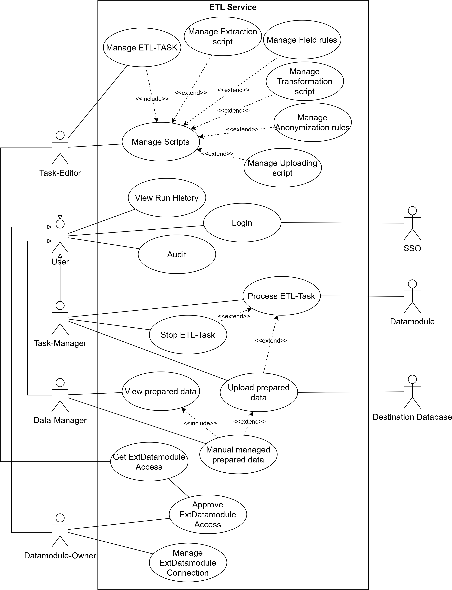
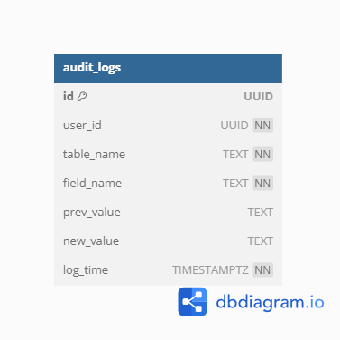
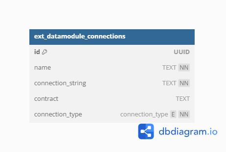
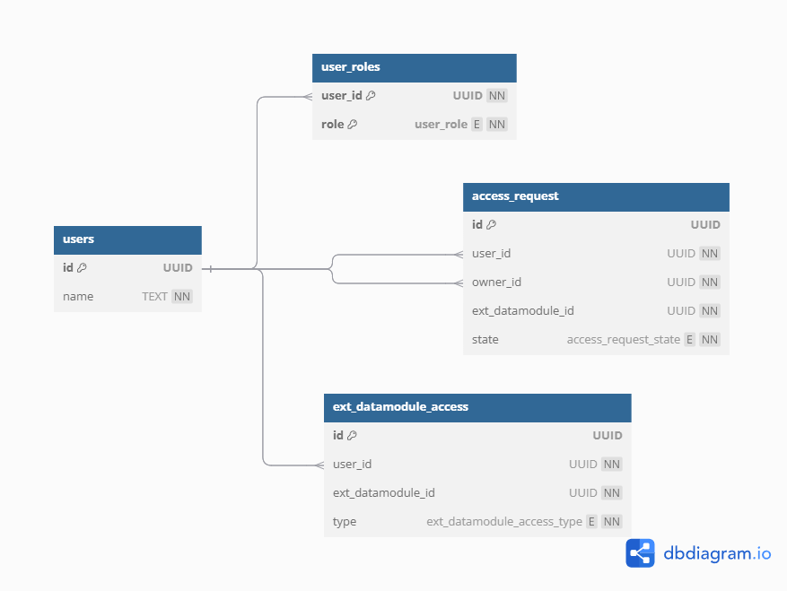
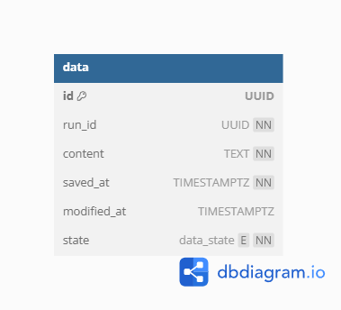
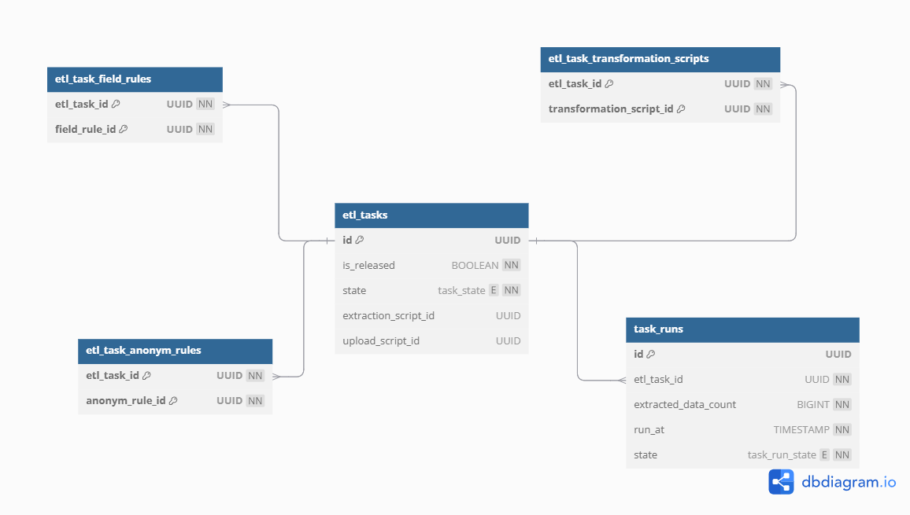

# Task - 11
### Team: ETL-Express

## Slides : [presentation](https://docs.google.com/presentation/d/1sPO1O3j6HCZ5yxCH-1OMncXUbxOt-GHoZHdvOctxJcM/edit?usp=sharing)
## Videos : [video](https://drive.google.com/file/d/13ZVpg9TqMHgHLnBeP7XYPV09lEYr4V6i/view?usp=sharing)

## Description:

```
In this task you are asked to do data design for your microservices. You may wish to follow the database technology the team selected at the previous task, or choose another one.

It is generally expected that some form of polyglot persistence will be used so that each microservice would get a different database. 

What to do

Expect each team member to work on a different microservice.
Follow the API-first approach presented at the lectures to decide on the SQL vs. NoSQL database and derive database schema or primary keys structure from the API and/or domain model.

HINT: Do not forget to properly handle any associations that cross microservice boundaries using either external/business key or proxy tables.

HINT: Choose the data model and DBMS most appropriate to the data and usage patterns

Results of the task
At least one physical schema per microservice in terms of ER diagram (crow-foot) or DDL SQL or in any other form specific to your DBMS/data model
A report 

Here is the template for the task report
https://tiny.cc/asd-template-data 

```

## Use-cases




## Components


## AUDIT LOGGER



```sql
CREATE EXTENSION IF NOT EXISTS "uuid-ossp";

CREATE TABLE audit_logs (
    id UUID PRIMARY KEY DEFAULT uuid_generate_v4(),
    user_id UUID NOT NULL,
    table_name TEXT NOT NULL,
    field_name TEXT NOT NULL,
    prev_value TEXT,
    new_value TEXT,
    log_time TIMESTAMPTZ NOT NULL DEFAULT NOW()
);
```

## ExtDatamodule MANAGER



```sql
CREATE EXTENSION IF NOT EXISTS "uuid-ossp";

CREATE TYPE connection_type AS ENUM ('gRPC', 'Http', 'database');

CREATE TABLE ext_datamodule_connections (
    id UUID PRIMARY KEY DEFAULT uuid_generate_v4(),
    name TEXT NOT NULL,
    connection_string TEXT NOT NULL,
    contract TEXT,
    connection_type connection_type NOT NULL
);
```

## USER MANAGER



```sql
CREATE EXTENSION IF NOT EXISTS "uuid-ossp";

CREATE TYPE access_request_state AS ENUM ('Wait', 'Approved', 'Declined');
CREATE TYPE user_role AS ENUM ('EditTask', 'ManageData', 'CreateExtDatamodule', 'ProcessEtlTask');
CREATE TYPE ext_datamodule_access_type AS ENUM ('Read', 'Write', 'Owner');

CREATE TABLE users (
    id UUID PRIMARY KEY DEFAULT uuid_generate_v4(),
    name TEXT NOT NULL
);

CREATE TABLE user_roles (
    user_id UUID NOT NULL REFERENCES users(id) ON DELETE CASCADE,
    role user_role NOT NULL,
    PRIMARY KEY (user_id, role)
);

CREATE TABLE ext_datamodule_access (
    id UUID PRIMARY KEY DEFAULT uuid_generate_v4(),
    user_id UUID NOT NULL REFERENCES users(id) ON DELETE CASCADE,
    owner_id UUID NOT NULL REFERENCES users(id),
    ext_datamodule_id UUID NOT NULL,
    type ext_datamodule_access_type NOT NULL
);

CREATE TABLE access_request (
    id UUID PRIMARY KEY DEFAULT uuid_generate_v4(),
    user_id UUID NOT NULL REFERENCES users(id) ON DELETE CASCADE,
    ext_datamodule_id UUID NOT NULL,
    state access_request_state NOT NULL DEFAULT 'Wait'
);

```

## DATA MANAGER



```sql
CREATE EXTENSION IF NOT EXISTS "uuid-ossp";

CREATE TYPE data_state AS ENUM ('Created', 'Modified', 'Sent');

CREATE TABLE data (
    id UUID PRIMARY KEY DEFAULT uuid_generate_v4(),
    run_id UUID NOT NULL,
    content TEXT NOT NULL,
    saved_at TIMESTAMPTZ NOT NULL DEFAULT NOW(),
    modified_at TIMESTAMPTZ,
    state data_state NOT NULL DEFAULT 'Created'
);
```

## ETL-TASK MANAGER




```sql
CREATE EXTENSION IF NOT EXISTS "uuid-ossp";

CREATE TYPE task_state AS ENUM ('Draft', 'Released', 'Completed');
CREATE TYPE task_run_state AS ENUM ('Running', 'Paused', 'Stopped');

CREATE TABLE etl_tasks (
    id UUID PRIMARY KEY DEFAULT uuid_generate_v4(),
    is_released BOOLEAN NOT NULL DEFAULT FALSE,
    state task_state NOT NULL DEFAULT 'Draft',
    extraction_script_id UUID,
    upload_script_id UUID,
    CONSTRAINT etl_tasks_state_check CHECK (state IN ('Draft', 'Released', 'Completed'))
);

CREATE TABLE etl_task_field_rules (
    etl_task_id UUID NOT NULL REFERENCES etl_tasks(id) ON DELETE CASCADE,
    field_rule_id UUID NOT NULL,
    PRIMARY KEY (etl_task_id, field_rule_id)
);

CREATE TABLE etl_task_anonym_rules (
    etl_task_id UUID NOT NULL REFERENCES etl_tasks(id) ON DELETE CASCADE,
    anonym_rule_id UUID NOT NULL,
    PRIMARY KEY (etl_task_id, anonym_rule_id)
);

CREATE TABLE etl_task_transformation_scripts (
    etl_task_id UUID NOT NULL REFERENCES etl_tasks(id) ON DELETE CASCADE,
    transformation_script_id UUID NOT NULL,
    PRIMARY KEY (etl_task_id, transformation_script_id)
);

CREATE TABLE task_runs (
    id UUID PRIMARY KEY DEFAULT uuid_generate_v4(),
    etl_task_id UUID NOT NULL REFERENCES etl_tasks(id) ON DELETE CASCADE,
    extracted_data_count BIGINT NOT NULL DEFAULT 0,
    run_at TIMESTAMP WITH TIME ZONE NOT NULL DEFAULT NOW(),
    state task_run_state NOT NULL DEFAULT 'Running'
);
```

## SCRIPTS MANAGER

## COMMON

```json
{
  "_id": UUID("..."),
  "type": "TYPE",   // Extraction, FieldRule, AnonymizationRule, Transformation, Uploading
  "released": false,
  "fields": [ 
    { "source": "ext_datamodule_id_1", "name": "fieldName1" },
    { "source": "ext_datamodule_id_2", "name": "fieldName2" }
  ],
  ...
}
```

## Field Rule
```json
{
    ...
    "fieldRuleType": "TYPE",     // FillEmpty, IgnoreEmpty, RemoveEmpty, FillOutOfRange, IgnoreOutOfRange, RemoveOutOfRange
    "defaultValue": {...},            
    "minValue": {...},                
    "maxValue": {...},                
    "fieldType": "string indicating type"
}
```

## Anonymization Rule

```json
{
    ...
    "anonymizationRuleType": "Type"   //  Generalization,  Suppression, Anatomization, Permutation, Pertubation

}
```

## Transformation

```json
{
    ...
    "transformationType": "Type",   //  Merge, Update
    "transformationScript": "string or null"
}
```

## Common scripts examples

### Get by id:

```js
const script = db.processing_scripts.findOne({_id: UUID("...")});
```

### Get by type:

```js
db.processing_scripts.find({type: "TransformationScript"});
```

### Get released:

```js
db.processing_scripts.find({released: true});
```
