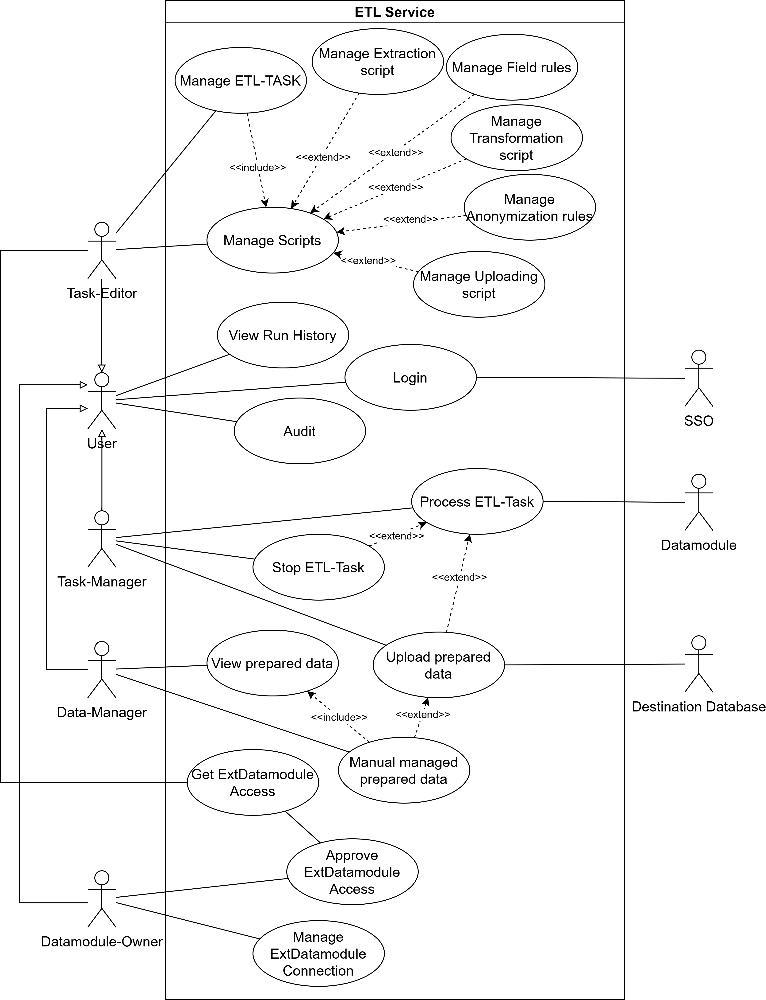
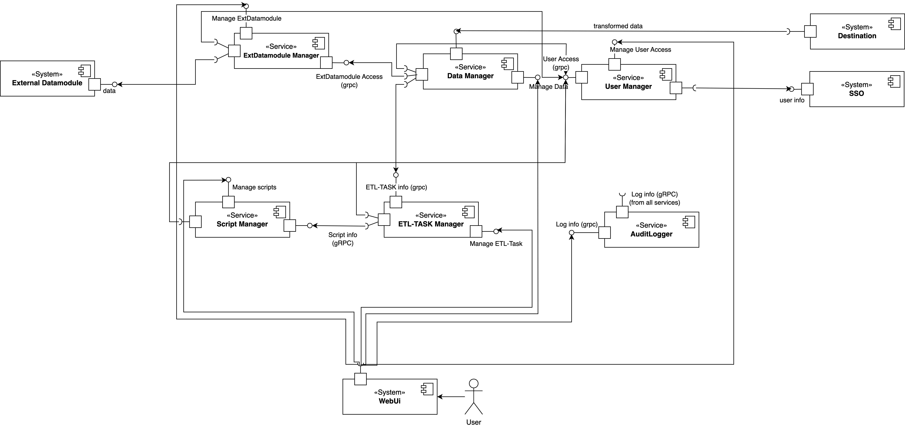
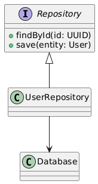
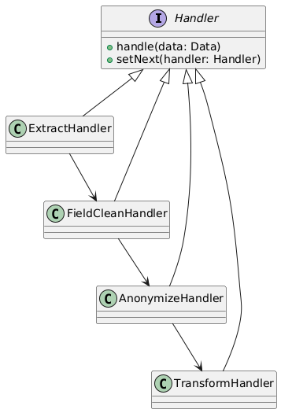
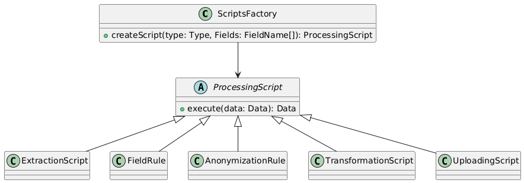
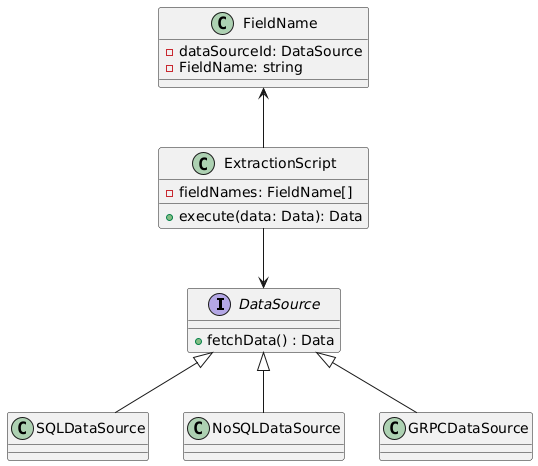

# Task - 12
### Team: ETL-Express

## Slides : [presentation](https://docs.google.com/presentation/d/1vhCtnIIT0kSvNEaIVmzJJqK83QdTSXgVF6MRLDDw8G0/edit?usp=sharing)
## Videos : [video](https://drive.google.com/file/d/1yEgEvLpF5I9y9Py9MYifrQqDwegukT-L/view?usp=sharing)

## Description:

```
Define and write down design principles and architectural drivers that you use to develop high level architecture for your team project. After that apply patterns and design heuristics (like SOLID, GoF, DB access, etc) to explain the detailed design of the microservices.

Try to come up with such principles so that if applied to system requirements you would get the same high level structure of the system as it is. Three such principles is enough.

NOTE: detailed design cases should follow from the architectural principles and drivers defined previously

HINT: use specific wording for the principles as a commandment, not as a result of prior development, i.e. “system shall follow microservices architecture” instead of “we developed three microservices”

NOTE: there should be at least one detailed design case per team member

Results of the task 
2-3 architectural principles or drivers for the project
At least one detailed design case that illustrates application of the principles
a report 

Here is a link to the template
https://tiny.cc/asd-template-detailed 
Task 11 - due 10/12/


```

## Use-cases




## Components




## ARCHITECTURAL PRINCIPLES

### API DRIVEN DEVELOPMENT

```
API-driven development is the practice of designing and building APIs first, then creating the rest of an application around them.
```

Benefits:

1. Clarity and Consistency
    - Centralized, standardized API definitions prevent inconsistencies across services.
2. Faster Development and Testing
    - Enables parallel development by providing API stubs and mock servers.
    - Simplifies testing with tools like Swagger and Postman.
3. Simplified Integration
    - Standardized APIs ensure seamless integration with external systems.
4. Improved Modularity and Scalability
    - Independent services with clear API boundaries allow better scaling.
5. Flexibility for Evolving Requirements
    - Simplifies adding new functionality without disrupting existing workflows.


### SEPARATION of CONCERNS (LAYER ARCHITECTURE)

```
Layered designs in information systems are another embodiment of separation of concerns (e.g., presentation layer, business logic layer, data access layer, persistence layer).
```

Benefits:

1. Clear Responsibility Division
    - Each layer has a distinct purpose (e.g., presentation, business logic, data access).
    - Reduces complexity by isolating functionalities.
2. Maintainability
    - Changes in one layer do not impact other layers.
    - Easier to debug and extend specific components.
3. Scalability
    - Layers can be scaled independently based on demand (e.g., scaling data access for high query loads).
    - Supports horizontal and vertical scaling.
4. Testability
    - Layers can be tested in isolation, improving reliability and simplifying automated testing.
    - Mock dependencies at different layers for unit tests.
5. Reusability
    - Common logic (e.g., validation, transformation) is centralized in the business layer, reducing duplication.
    - Promotes reusable services across multiple applications.

## DESIGN PATTERNS

### REPOSITORY PATTERN



#### Problem

How to abstract the data access logic for services?

#### Solution

Use a repository pattern to centralize data access and encapsulate database operations.

#### Benefits

Abstraction of Data Access, Improved Maintainability, Reusability, Testability


### CHAIN OF RESPONSIBILITY PATTERN



#### Problem

How to process ETL tasks through a series of steps?

#### Solution

Use a chain of responsibility where each handler processes the data and passes it to the next handler in the chain.

#### Benefits

Flexible Processing, Encapsulation of Responsibilities, Scalability

### FACTORY PATTERN



#### Problem

How to dynamically create and configure ETL task scripts?

#### Solution

Use a factory to create specific ETL task scripts dynamically based on input parameters.

#### Benefits

Encapsulation and Flexibility of Object Creation, Testability

### BRIDGE PATTERN



#### Problem

How to separate ETL processing logic from the data source (e.g., SQL, HTTP, gRPC)

#### Solution

Use the bridge pattern to separate the abstraction from its implementation (data source)

#### Benefits

Scalability and Flexibility, Reusability