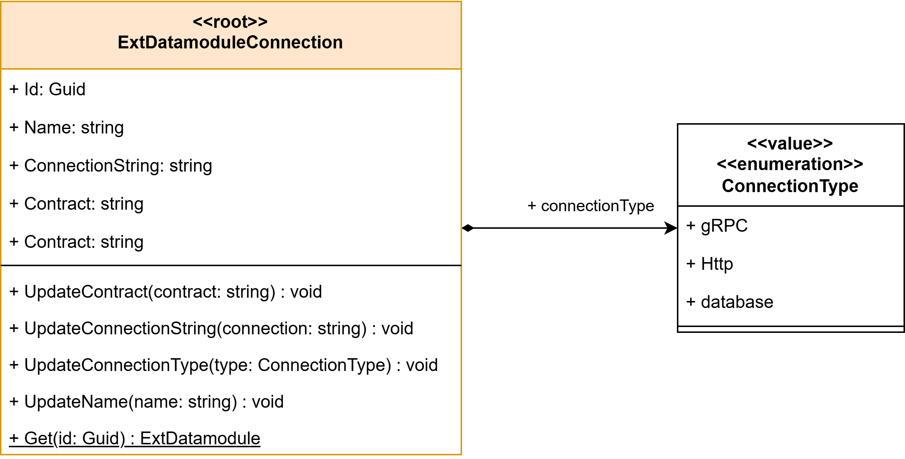

# Task - 9
### Team: ETL-Express

## Slides : [presentation](https://docs.google.com/presentation/d/1macLfe1W_ZUKKjyOVfiq15uhpahXZF-eTe2a0kVHs8o/edit?usp=sharing)

## Description:

```
Elicit addressable resources and compose microservices. Follow the guidelines given at the lectures

See the template for the report
https://tiny.cc/asd-template-components 

What to do

Reuse your aggregates model from Task 9.
Elicit addressable resources for each of the aggregates and list responsibilities assigned to these resources.
Devise a microservice for the aggregates, domain services and their resources. Draw a UML2 components diagram or a physical DFD diagram. Fill in the traceability table.
Verify that components are connected where interactions take place and if you use DFD - then the relevant information is transferred, see Event storming diagram from the previous task.
Propose a set of technologies you would like to use to implement the system. (may submit next week)

NOTE: at least one microservice per team member is needed.

HINT: you do not need to detail the interfaces of the components yet

Results of the task:

Updated aggregates with a list of available resources
Component or physical DFD diagram
Report with slides
```

## Use-cases


### Use Case: Login

Description: The user logs into the ETL service using an external Single Sign-On (SSO) system for authentication.

- Primary Actor: User
- Goals: Gain authorized access to the ETL service
- Pre-conditions: User has valid credentials with the external SSO provider
- Post-conditions: User is authenticated and granted access to the ETL service's functionalities

Basic flow:
1. User navigates to the ETL service login page.
2. System redirects the user to the external SSO provider's authentication page.
3. User enters their credentials and submits the form.
4. SSO provider authenticates the user and redirects back to the ETL service with authentication tokens.
5. System validates the tokens and establishes a session for the user.
6. User gains access to the ETL service's dashboard and features.

---

### Use Case: Manage Scripts
**Description:** The user manages all types of scripts required for ETL processing, including creating, updating, and configuring Extraction scripts, Field Rules, Transformation scripts, Anonymization rules, and Uploading scripts.

- **Primary Actor:** Task-Editor
- **Goals:** Create and manage scripts for extraction, field rules application, transformation, anonymization, and uploading
- **Pre-conditions:** User must be logged into the service
- **Post-conditions:** Scripts are created or updated successfully, ready for use in ETL tasks

**Basic flow:**
1. User navigates to the script management section in the ETL service interface.
2. System presents options to create a new script or edit an existing one.
3. User selects the type of script they wish to create or modify.
4. System displays relevant fields for defining or updating the script properties.
5. User completes all required fields, specifying extraction details, transformation logic, anonymization parameters, or upload rules as needed.
6. User saves the scripts configuration.
7. System validates the input and saves the scripts in the database, confirming its readiness for integration into ETL task.

---

### Use Case: Manage ETL Task
**Description:** User creates and configures an ETL task, which includes adding scripts created in the Manage Scripts use case.

- **Primary Actor:** Task-Editor
- **Goals:** Create, configure, and update ETL tasks by adding relevant scripts
- **Pre-conditions:** User must be logged into the service
- **Post-conditions:** ETL task is created or updated with all necessary scripts, ready for execution

**Basic flow:**
1. User selects the option to create a new ETL task or update an existing one.
2. System presents a form to configure ETL task details.
3. User provides the basic task configuration.
4. User selects and attaches relevant scripts (Extraction script, Field Rules, Transformation scripts, Anonymization rules, Uploading script) from the list of available scripts.
5. User finalizes and saves the ETL task.
6. System validates the task setup, ensuring all necessary scripts are included, and saves the task configuration.

**Alternate path:**
- **Missing Scripts:** If required scripts are not attached, the system prompts the user to complete the setup by attaching necessary scripts before saving.

---

### Use Case: Manage ExtDatamodule Connection

Description: The user creates and configures connections to external datamodules by specifying the datamodule's contract, connection string, connection type, and assigning owners to the connection.

- Primary Actor: User
- Goals: Establish and manage connections to external datamodules for data extraction or interaction
- Pre-conditions: User must be logged into the service and have necessary permissions to manage extDatamodule connections
- Post-conditions: A new external datamodule connection is created and saved, ready for use in ETL tasks

Basic flow:
1. User navigates to the "Manage External Datamodule Connections" section in the ETL service.
2. System presents options to create a new connection or edit existing ones.
3. User selects the option to create a new connection.
4. System displays a form for defining the connection properties.
5. User enters the required information:
   - Specifies the datamodule contract details.
   - Inputs the connection string.
   - Selects the type of connection (e.g., SQL, gRPC, API).
   - Assigns owners for the connection by selecting users or user groups.
6. User saves the connection configuration.
7. System validates the input and checks for any conflicts or errors.
8. Upon successful validation, system saves the new connection in the database.
9. System confirms the connection is ready for use and notifies the assigned owners.

---

### Use Case: Get ExtDatamodule Access

Description: The user requests access to an existing external datamodule connection by sending a request to the connection's owners for approval.

- Primary Actor: User
- Goals: Obtain permission to use a specific external datamodule connection
- Pre-conditions: User must be logged into the service; the external datamodule connection exists
- Post-conditions: An access request is sent to the connection's owners for approval

Basic flow:
1. User navigates to the list of available external datamodule connections.
2. System displays connections along with their access status and brief descriptions.
3. User identifies a connection they need access to and selects the option to "Request Access."
4. System prompts the user to provide a reason or additional details for the access request.
5. User submits the access request.
6. System sends a notification to the connection's owners with the access request details.
7. User receives confirmation that the request has been sent and awaits approval.

---

### Use Case: Approve ExtDatamodule Access

Description: The owners of an external datamodule connection review and approve or deny access requests from users wishing to use the connection.

- Primary Actor: Connection Owner
- Goals: Manage access requests by approving or denying user requests to use the external datamodule connection
- Pre-conditions: Connection owner must be logged into the service; there are pending access requests
- Post-conditions: User access is granted or denied; requester is notified of the decision

Basic flow:
1. Connection owner receives a notification of a pending access request.
2. Owner navigates to the "Access Requests" section in the ETL service.
3. System displays a list of pending access requests with requester information and reasons.
4. Owner selects a request to review.
5. System shows detailed information about the requester.
6. Owner decides to approve or deny the request for the requester.
7. Owner submits their decision.
8. System updates the access permissions accordingly.
   - If approved, the requester is granted access to the datamodule connection.
   - If denied, the requester is notified with the owner's decision.
9. System sends a notification to the requester informing them of the decision.

---

### Use Case: Process ETL Task
**Description:** The system processes an ETL task, involving data extraction, cleaning, transformation, anonymization, and preparation for uploading.

- **Primary Actor:** Task-Manager
- **Goals:** Execute ETL processing, prepare data for eventual upload
- **Pre-conditions:** ETL task is fully configured and validated
- **Post-conditions:** Data is processed and stored in Outbox, awaiting user confirmation for upload

**Basic flow:**
1. System initiates the ETL task by executing the configured Extraction script to pull data from the specified data module.
2. System applies Field Rules to clean and standardize data fields.
3. System runs the Transformation script, performing data merging or other required transformations.
4. System applies Anonymization rules, using designated methods to anonymize each data field.
5. System saves the processed data in the Outbox database, pending user review and confirmation for upload.

**Alternate path:**
- **Processing Error:** If an error occurs at any stage, the system logs the error and informs user, and stopped executing.

---

### Use Case: Stop ETL Task
**Description:** User can pause or completely stop an ETL task. If stopped, the user can choose to clear Outbox and any partially sent data to the destination service.

- **Primary Actor:** Task-Manager
- **Goals:** Pause or terminate an active ETL task
- **Pre-conditions:** ETL task is in progress
- **Post-conditions:** ETL task is paused or terminated, and data in the Outbox may be cleared if chosen

**Basic flow:**
1. User selects the option to stop or pause the ETL task.
2. System pauses or canceles the ongoing ETL task.
3. If the task is terminated, the system prompts the user to confirm the deletion of data in Outbox and any partially sent data in the destination service.
4. User confirms, and the system clears Outbox and destination if necessary.

---

### Use Case: View Run History

Description: The user views the history of executed ETL tasks, including details such as the amount of data processed during each run.

- Primary Actor: User
- Goals: Monitor and review the execution history of ETL tasks, including performance metrics
- Pre-conditions: User must be logged into the service
- Post-conditions: User successfully views the run history and relevant details of ETL tasks

Basic flow:
1. User navigates to the "Run History" section in the ETL service interface.
2. System displays a list of previously executed ETL tasks with summary information.
3. User selects a specific task or run to view detailed information.
4. System presents detailed data, including the amount of data processed, execution time and current state.

---

### Use Case: View Prepared Data
**Description:** User reviews data that has been processed and saved in the Outbox.

- **Primary Actor:** Data-Manager
- **Goals:** Access and review processed data
- **Pre-conditions:** Processed data is available in the Outbox
- **Post-conditions:** User can view data details stored in the Outbox

**Basic flow:**
1. User navigates to the Outbox section.
2. System displays a list of prepared data entries.
3. User selects a data entry to view details.
4. System presents the details of the selected data.

---

### Use Case: Manage Prepared Data
**Description:** User manages the processed data in the Outbox, with options to add, edit, or delete entries.

- **Primary Actor:** Data-Manager
- **Goals:** Modify or manage prepared data entries in the Outbox
- **Pre-conditions:** Processed data entries are available in the Outbox
- **Post-conditions:** Data is updated, added, or removed as per user instructions

**Basic flow:**
1. User accesses the Outbox data management section.
2. System presents options to add, edit, or delete data entries.
3. User selects an action and modifies the data as needed.
4. System validates changes and updates Outbox accordingly.

---

### Use Case: Upload Prepared Data
**Description:** User decides to upload processed data from the Outbox to the destination. If no action is taken, data will be deleted automatically after a retention period.

- **Primary Actor:** Data-Manager
- **Goals:** Confirm and initiate data upload from the Outbox
- **Pre-conditions:** Data is processed and available in the Outbox
- **Post-conditions:** Data is either uploaded to the destination or deleted based on user action

**Basic flow:**
1. User reviews the data in the Outbox and selects the option to upload.
2. System confirms the selection and initiates the upload process.
3. Data is transferred to the destination, and system updates Outbox to indicate completion.

---

### Use Case: Audit
**Description:** The system records all actions by users and the system itself, allowing users to review the history of changes and actions.

- **Primary Actor:** User
- **Goals:** Track and review audit logs for all actions
- **Pre-conditions:** Audit logs are enabled and accessible
- **Post-conditions:** User can view a detailed record of actions in the system

**Basic flow:**
1. User navigates to the audit log section.
2. System presents a searchable list of recorded actions.
3. User selects specific entries to view details.
4. System displays the action, timestamp, actor, and any relevant changes or results.


## Aggregate - Processing Script


## Aggregate - ETL-Task


## Aggregate - Data


## Aggregate - AuditLogs


## Aggregate - User


## Aggregate - Ext Datamodule




## Aggregate - Components


## Tracebility

| Microservice          | Resource               | Domain classes                                                                                                | Use cases                                                                                                 |
|-----------------------|------------------------|---------------------------------------------------------------------------------------------------------------|-----------------------------------------------------------------------------------------------------------|
| Script Manager        | Processing script Info | Processing script, extraction script, uploading script, field rule, anonymization rule, transformation script | Manage Scripts, Manage ETL Task, Process ETL Task                                                         |
| ETL-Task Manager      | ETL-Task Info          | ETL-Task, Task Run                                                                                            | Manage ETL Task, Process ETL Task, Stop ETL Task, View Run History,                                       |
| Data Manager          | Prepared data          | Data                                                                                                          | Process ETL Task, View prepared data, Upload prepared data, Manual managed prepared data                  |
| ExtDataModule Manager | ExtDatamodule Info     | ExtDatamoduleConnection                                                                                       | Manage ExtDatamodule Connection, Get ExtDatamodule Access, Approve ExtDatamodule Access, Process ETL Task |
| User Manager          | User acesses info      | User, ExtDatamoduleAccess, AccessRequest                                                                                     | All use cases (require access)                                                                            |
| Audit Logger          | Logs info              | Audit Log                                                                                                     | Audit                                                                                                     |
